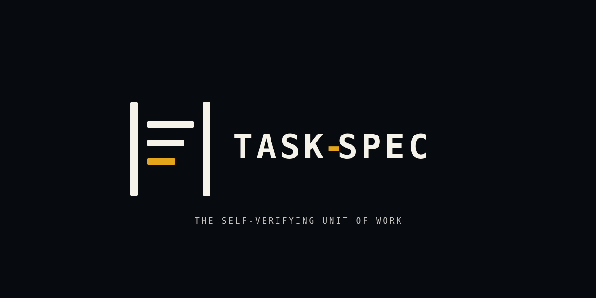
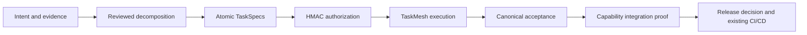
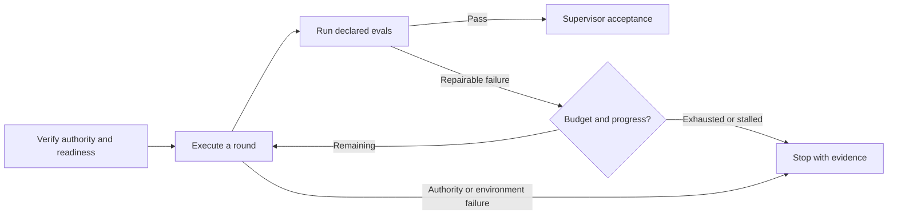

<div align="center">



# TaskSpec

**From engineering intent to accepted work.**

Native decomposition, signed atomic contracts, bounded execution recipes,<br/>
and verifiable acceptance across coding harnesses.

[](CHANGELOG.md)
[](https://github.com/luanmorenommaciel/task-spec/releases/latest)
[](https://github.com/luanmorenommaciel/task-spec/actions/workflows/ci.yml)
[](LICENSE)

[Start here](#start-here) · [Install](#installation) · [Chat](#chat-experience) ·
[Workflow](#step-by-step-usage) · [TaskMesh](#taskmesh-execution) ·
[Trust](#trust-boundaries) · [Repository](#repository-map) · [Docs](#documentation)

</div>

## Start here

TaskSpec gives engineering work a durable contract: the outcome, allowed changes,
required evidence, execution budget, and authorization for that exact revision.
TaskMesh executes authorized tasks and dependency graphs. Your coding harness
performs the implementation; TaskSpec verifies acceptance.

| Your goal | Start with |
|---|---|
| Understand the complete experience | [Data-engineering chat walkthrough](docs/guides/toolkit/chat.md) |
| Try one complete lifecycle | [Install](#installation), then `taskspec demo` |
| Make a small, understood change | [Direct atomic authoring](#direct-atomic-authoring) |
| Break down a larger initiative | [Native decomposition](#step-by-step-usage) |
| Run or recover authorized work | [TaskMesh execution](#taskmesh-execution) |
| Evaluate the claims | [Reviewer route](docs/getting-started/reviewer-route.md) and [release evidence](release/README.md) |

**Current status:** `main` contains the **3.10.0 integrated-toolkit candidate**.
The latest published release is **v3.9.0**. Native toolkit features remain opt-in
while provider/chat qualification and the comparative pilot are incomplete.
A passing CI run is evidence for its source revision, not release publication
or a claim of production reliability. See the [release process](docs/maintainers/release-process.md).

## How it works



| Area | Responsibility | Durable result |
|---|---|---|
| Chat skill | Inspect state, gather evidence, explain decisions, operate the CLI | Conversation grounded in repository artifacts |
| Native decomposition | Seams → swimlanes → capability legs → atomic tasks | Reviewed topology, TaskPlan, and lineage |
| Atomic contract | One outcome, write boundary, proof, and bounded recipe | Revision-bound HMAC seal |
| TaskMesh | Dependencies, contention, attempts, leases, repair, and recovery | Attempt records and evaluation evidence |
| Acceptance | Verify the configured proof and authority boundaries | Canonical acceptance record |
| Release and maintenance | Connect existing CI/CD and observations to corrective work | Operational evidence and successor intent |

Small work can start directly with one atomic task. SDLC concerns such as design,
testing, and deployment attach to affected work; they do not create mandatory
swimlanes. See the [integrated toolkit](docs/guides/toolkit/index.md).

## Installation

Choose the source candidate for the integrated toolkit or the pinned published
release for the existing 3.9.0 workflow. Install the CLI and skill together.

### Source candidate: complete toolkit

Requires Python 3.11+ and Go for the source-built Mesh helper.

```bash
git clone https://github.com/luanmorenommaciel/task-spec.git \
  "$HOME/.local/share/task-spec-src"
bash "$HOME/.local/share/task-spec-src/install.sh" --global --copy --toolkit
export PATH="$HOME/.local/bin:$PATH"
taskspec doctor
taskspec mesh doctor
taskspec recipe list
taskspec guide decomposition
```

The toolkit installs the CLI, matching Mesh helper, harness skills and guides,
and a private Python runtime with locked dependencies. Core-only source installs
can omit `--toolkit`. Project-local installs use `--target /path/to/project --copy`.
Existing unmanaged destinations are refused by default.

### Published release: v3.9.0

```bash
release_dir="$(mktemp -d)"
gh release download v3.9.0 --repo luanmorenommaciel/task-spec \
  --pattern 'task-spec-3.9.0.tar.gz*' --pattern 'taskspec-meshd-*' \
  --dir "$release_dir"
(cd "$release_dir" && shasum -a 256 -c task-spec-3.9.0.tar.gz.sha256)
tar -xzf "$release_dir/task-spec-3.9.0.tar.gz" -C "$release_dir"
bash "$release_dir/task-spec-3.9.0/install.sh" --global --copy --with-mesh
```

The published 3.9.0 archive does not contain native 3.10.0 decomposition or recipes.
For npm, Claude marketplace, installer options, and harness destinations, use
[installation reference](docs/getting-started/installation.md).

### Requirements

- **Core:** Bash 3.2+, Git, Python 3, and `shellcheck` for the PRE-gate and demo;
  OpenSSL, `shasum`, or `sha256sum` for HMAC.
- **Native decomposition:** Python 3.11+ in the provisioned private environment.
- **TaskMesh source build:** Go 1.25+; supervised execution also needs its selected harness.
- **Attested autonomous execution:** the required pinned container runtime,
  provider configuration, and attestation setup. See [execution](docs/guides/toolkit/execution.md).

### Prove it in one command

```console
$ taskspec demo
Task-Spec isolated lifecycle
  PLAN=VALID
  DOD=COMPLETE
  VERDICT=DELEGATE TIER=1
  HANDOFF=TaskHandoff/v3
  EVAL=PASS
  ACCEPTED=1
DEMO=READY
```

The demo creates and removes a disposable repository. It exercises planning,
sealing, handoff, evals, and acceptance without changing your project.
Command proof is indexed in [README command coverage](docs/readme-command-coverage.json).

## Chat experience

Use the `task-spec` skill inside Codex, Claude Code, Kimi, Grok Build, or Cursor.
The skill reads current CLI state before acting; plans, attempts, and acceptance
records preserve context across sessions.

| Harness | User-level skill | Project-local skill |
|---|---|---|
| Codex / Kimi | `~/.agents/skills/task-spec/` | `.agents/skills/task-spec/` |
| Claude Code | `~/.claude/skills/task-spec/` | `.claude/skills/task-spec/` |
| Grok Build | `~/.grok/skills/task-spec/` | `.grok/skills/task-spec/` |
| Cursor | `~/.cursor/skills/task-spec/` | `.cursor/skills/task-spec/` |

Start with an outcome:

> Use task-spec. Inspect this repository and plan reliable payment ingestion:
> handle duplicates and late updates, quarantine malformed records, and prove
> reconciliation. Show unresolved decisions and proposed atomic tasks. Deployment
> is outside this request.

Then use ordinary requests as the work progresses:

| Say | The skill should do |
|---|---|
| “Why are these tasks separate?” | Explain boundaries, dependencies, and independently assessable completion |
| “What needs my decision?” | Show missing product decisions or applicable authorization |
| “Run the authorized work.” | Verify seals and dispatch eligible tasks through TaskMesh |
| “Why did execution stop?” | Inspect the actual attempt, evidence, deadline, and remaining budget |
| “Continue this initiative.” | Reconstruct persisted state and reuse decisions for the applicable revision |
| “What is accepted and what remains unproven?” | Read canonical acceptance and explicit capability proof gaps |

Normal replies show **outcome, current state, evidence or blocker, and next action**.
Plan review, task authorization, supervisor acceptance, and deployment decisions
retain their own boundaries. Routine repair within an authorized recipe does not
need a new decision. A denied tool action stops at the reported boundary.

The [data-engineering walkthrough](docs/guides/toolkit/chat.md) explains the phases,
internal commands, and artifacts. Its dialogue is illustrative; supported skill
installation is distinct from completed behavioral qualification of every harness.
Root [SKILL.md](SKILL.md) and its [repository mirror](skills/task-spec/SKILL.md)
remain byte-for-byte identical.

## Step-by-step usage

The following is the **3.10.0 native initiative path**. Run commands inside your
project. Replace example IDs, paths, reviewer identities, and reasons with the
actual reviewed work; these are lifecycle checkpoints, not an unattended script.

### 1. Prepare and capture intent

```bash
taskspec init
taskspec setup signing
taskspec doctor
taskspec agent-context
taskspec example intent --out intent.md
```

Edit `intent.md` to describe your project, then initialize the initiative:

```bash
taskspec decompose init payments --intent-file intent.md
```

Have the agent research the repository and author the decomposition recipe.

### 2. Prepare, review, and materialize

```bash
taskspec decompose prepare payments --recipe recipe.yaml
taskspec decompose status payments
```

Inspect the proposed topology and resolve material decisions before recording
explicit approval:

```bash
taskspec decompose review payments --accept --reviewer <identity> --reason <decision>
taskspec decompose compile payments
taskspec plan --manifest tasks/.plans/payments/task-plan.json
taskspec batch --plan tasks/.plans/payments/task-plan.json
```

Review is authenticated against the snapshot. Compilation preserves lineage;
materialization creates unsealed leaves. [Decomposition guide](docs/guides/toolkit/decomposition.md).

### 3. Inspect and authorize exact task revisions

```bash
taskspec validate tasks/T-...-payments.md
taskspec dod tasks/T-...-payments.md
taskspec author-doctor tasks/T-...-payments.md
taskspec recipe show test-first
taskspec gate --stamp tasks/T-...-payments.md
```

Resolve recipe instructions before sealing. Check outcome, writable paths,
constraints, dependencies, eval quality, and limits. Retain the authorized tasks,
plan bundle, snapshots, and source evidence in the Git revision used by Mesh.
Git recording does not replace review or the seal. [Atomic recipes](docs/guides/toolkit/recipes.md).

### 4. Execute and inspect

```bash
taskspec mesh init
taskspec status --initiative payments
taskspec graph --initiative payments --view capabilities
taskspec mesh frontier
taskspec mesh run --initiative payments --execute
```

Initialize Mesh in the authorized host environment before restricted harness use.
A run starts the currently eligible wave. Passing supervised evals await supervisor
acceptance. Use the [execution guide](docs/guides/toolkit/execution.md) for acceptance,
subsequent waves, recovery, and the final integration route.

### Direct atomic authoring

For a small, understood change, begin with `new` and author its outcome and evals:

```bash
taskspec new add-search S codex
```

After inspecting and sealing that task, ordinary tasks without managed recipes
can use the direct handoff path:

```bash
taskspec handoff tasks/T-...-add-search.md --backend codex \
  --out .taskspec/handoffs/add-search.json
```

Give the handoff to the executor. After implementation, inspect and accept its
actual result through the supervisor workflow:

```bash
taskspec run tasks/T-...-add-search.md
taskspec accept --stamp --gold-sanity \
  --handoff .taskspec/handoffs/add-search.json tasks/T-...-add-search.md
taskspec transition T-...-add-search done
taskspec ready --all
taskspec graph --check
taskspec status T-...-add-search
```

`run` executes evals. `accept` verifies acceptance. Managed recipes use TaskMesh,
including a graph containing one task. [First accepted task](docs/getting-started/first-task.md).

## TaskMesh execution

TaskMesh owns scheduling and the managed attempt lifecycle. It serializes
conflicting writes and declared shared resources, retains leases and fencing,
and records executor identity, evals, timing, and available usage evidence.



- Recipes resolve versioned strategies before sealing: `direct`, `test-first`,
  `plan-execute-verify`, `diagnose-repair-verify`, and `research-synthesize-verify`.
- New managed recipes default to three rounds and a two-round no-progress breaker,
  bounded by the signed task budget. Resume preserves consumed rounds and the deadline.
- Supervised execution is the default. Required unavailable enforcement refuses;
  attested autonomy remains opt-in.
- `mesh run` without `--execute` still creates state. Use `--dry-run` for previews.
- `mesh finish` reports a human integration route; it does not merge or push the user branch.

See [execution and recovery](docs/guides/toolkit/execution.md),
[TaskMesh contracts](docs/reference/taskmesh-contracts.md), and
[trust boundaries](docs/trust/taskmesh-boundaries.md).

## Trust boundaries

| Evidence | What it establishes | What it does not establish |
|---|---|---|
| Plan review | Approval bound to the reviewed topology | Permission to execute every leaf |
| HMAC seal | Shared-key authorization and integrity of an exact task revision | Author identity, isolation, or semantic truth |
| Passing evals | The configured checks passed in their evaluated environment | A complete or correct oracle |
| Canonical acceptance | Required task proof and authority checks passed | Deployment or production health |
| Capability proof | Explicit composition obligations have evidence | Completion merely from child status labels |
| Imported operational receipt | A reported result tied to its source and artifacts | Independent verification of target health |
| Hosted CI | The named checks passed on the named revision and platforms | Provider quality or release publication |

## Repository map

| Surface | Where to look |
|---|---|
| Normative contract | [spec/](spec/README.md): formats, schemas, conformance |
| CLI and engine | `bin/taskspec`, `src/`: authoring, decomposition, recipes, gates, acceptance |
| Execution | `src/meshctl/` cockpit; `mesh/` Go control plane |
| Chat and adapters | [SKILL.md](SKILL.md), [skills/](skills/README.md), [harness/](harness/README.md) |
| Learning and reference | [docs/](docs/index.md): getting started, guides, concepts, reference |
| Validation | [tests/](tests/README.md), `spec/conformance/`, `.github/workflows/` |
| Distribution and evidence | `install.sh`, `tools/`, [release/](release/README.md) |
| Engine's own work | [tasks/](tasks/README.md), `.taskspec/`: backlog and acceptance records |

The [ownership map](docs/maintainers/repository-map.md) explains change boundaries.
Frozen release evidence and accepted task history retain their original paths.
New how-tos belong in `docs/guides/`; canonical rules remain in `spec/`.

## Documentation

- **Learn:** [toolkit journey](docs/guides/toolkit/index.md), [chat walkthrough](docs/guides/toolkit/chat.md), [first task](docs/getting-started/first-task.md).
- **Operate:** [decomposition](docs/guides/toolkit/decomposition.md), [recipes](docs/guides/toolkit/recipes.md), [execution](docs/guides/toolkit/execution.md), [acceptance](docs/guides/toolkit/acceptance.md).
- **Evolve:** [replanning](docs/guides/replanning-and-recovery.md), [migration](docs/guides/toolkit/migration.md), [release and maintenance](docs/guides/toolkit/sdlc.md).
- **Inspect:** [CLI reference](docs/reference/cli.md), [format v3](spec/task-spec-v3.md), [opt-in v4](spec/task-spec-v4.md), [conformance](spec/conformance/README.md), [threat model](docs/trust/threat-model.md).

## Contributing

Start with [CONTRIBUTING.md](CONTRIBUTING.md), [OPERATING.md](OPERATING.md), and
[AGENTS.md](AGENTS.md). Run the same release gate used by hosted Ubuntu and macOS CI:

```bash
make check
```

Format changes update schemas, conformance fixtures, and the changelog together.
Skill changes preserve root/mirror parity and installed resources. Publication
follows the [release process](docs/maintainers/release-process.md).

Maintained by Luan Moreno Medeiros Maciel. [MIT licensed](LICENSE).
Report vulnerabilities through [SECURITY.md](SECURITY.md).

## Retained release evidence

This generated scorecard describes the **historical 3.8.1 release corridor**.
It is preserved as evidence, not a readiness score for the 3.10.0 candidate.
The [release catalog](release/README.md) separates the versioned corridors.

<!-- release-status:start -->
| Surface | Repository evidence | Status |
|---|---|---|
| Evidence-derived score | Only digest-matching retained artifacts earn points | **97/100**; target 97; release gate passed |
| Contract and trust | Revision-bound authorization, compatibility, and the explicit HMAC boundary | 24/25 |
| Lifecycle and recovery | Nested workspaces, graph recovery, atomic acceptance, and replay resistance | 25/25 |
| Documentation and DX | Installed reviewer route, executable docs, and generated status | 20/20 |
| Harness and packaging | All installation doors plus frozen Codex and Claude execution | 10/10 |
| Standards interoperability | Pinned official A2A and MCP SDK conformance | 9/10 |
| Private distribution and external proof | Hosted CI, private signed provenance, authenticated installs, and externally signed sandbox evidence | 9/10 |
| Publication | Task-Spec 3.8.1 at `351c39908ca0` | Published |
| Deliberately unclaimed | Semantic truth, ecosystem-wide certification, and long-running production reliability | 3 points remain unavailable by design |
<!-- release-status:end -->
