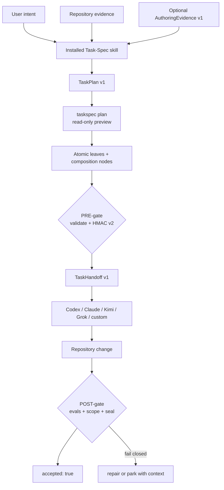
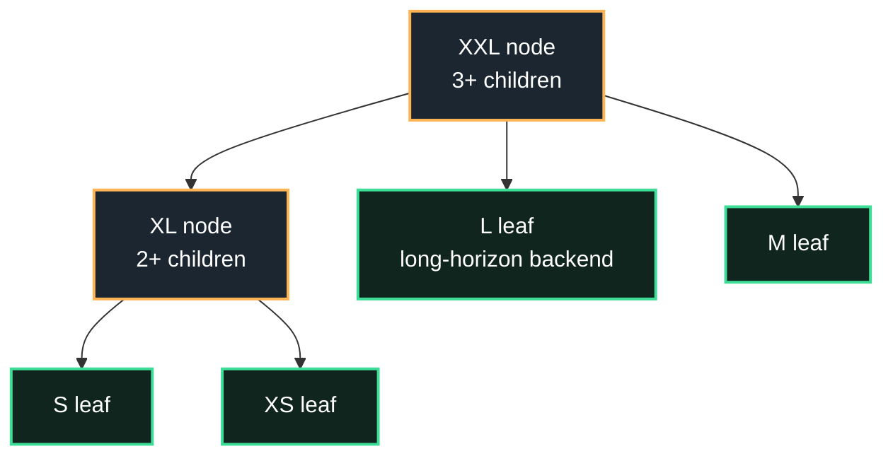
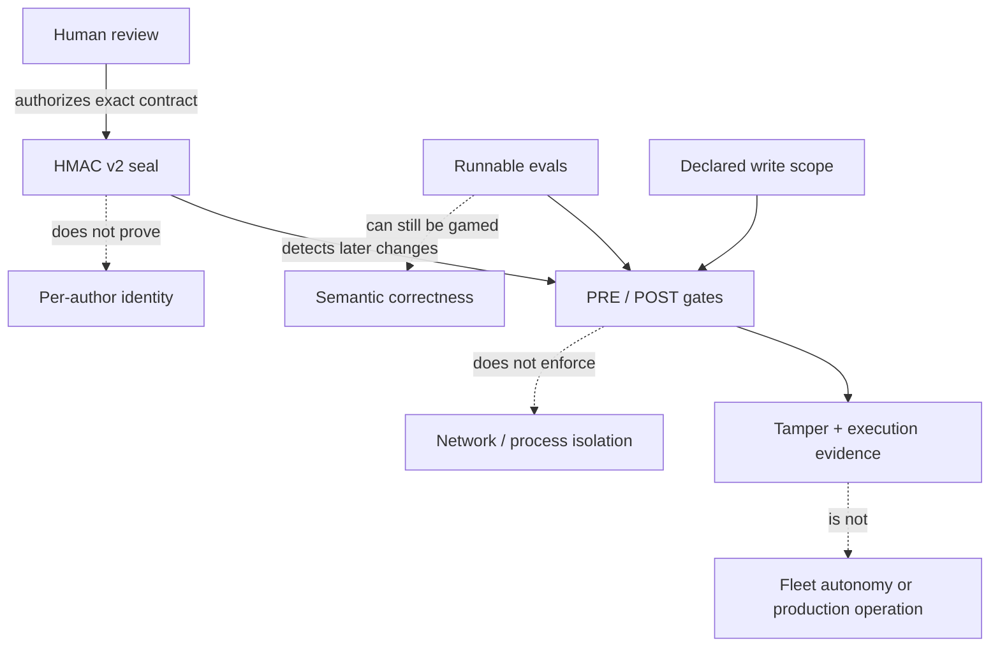

<div align="center">

[](https://github.com/luanmorenomaciel/task-spec)

<h1>Task-Spec</h1>

<p><strong>Define one atomic task. Seal its authority. Prove the work.</strong></p>
<p><em>The canonical, vendor-neutral unit of work for coding agents.</em></p>

[](CHANGELOG.md)
[](spec/task-spec-v3.md)
[](#requirements)
[](#current-verified-status)
[](LICENSE)

Works with **Codex · Claude Code · Kimi · Grok Build · any conformant executor**

[Install](#install) ·
[Quickstart](#quickstart-your-first-atomic-task) ·
[Steer from chat](#steer-it-from-chat) ·
[Anatomy](#inside-one-atomic-task) ·
[How it works](#how-it-works) ·
[Trust](#trust-boundaries) ·
[CLI](#the-taskspec-cli) ·
[Docs](#documentation)

</div>

---

## What is Task-Spec?

Task-Spec turns one intended repository change into a human-reviewable contract
that a coding agent can execute and a separate gate can verify. Each `T-*.md`
file carries its bounded write scope, dependencies, effort budget, runnable bash
evals, behavior-to-eval traceability, authorization seal, and acceptance state.

An ordinary checklist says what somebody hopes will happen. A Task-Spec also
says **what may change, what executable observation proves success, who
authorized that exact contract, and what must still pass after the agent says it
is done**.

Task-Spec deliberately stops at that boundary. It does not host models, schedule
a fleet, store credentials, or turn a weak eval into a wise oracle. It makes one
unit of work portable, tamper-evident, and independently checkable.

## Why it is different

- **The eval decides done.** Completion is an executable exit condition, not an
  agent-authored progress report.
- **Authority is sealed before execution.** HMAC v2 covers the task body and the
  fields that grant authority: paths, dependencies, effort, backend, agent,
  budgets, and requirements.
- **The executor does not grade itself.** PRE-gate authorization, execution, and
  POST-gate acceptance are separate moments with separate responsibilities.
- **The contract survives the harness.** The same sealed leaf can be handed to
  Codex, Claude Code, Kimi, Grok Build, or another conformant executor.
- **Failure has a name.** Invalid structure, weak evals, broken seals,
  out-of-scope writes, blocked dependencies, and red exit checks fail closed.
- **The core stays small.** Bash 3.2 plus standard-library Python; offline by
  default; no model or research-provider credentials.

## Install

All installation doors produce the same Task-Spec 3.6 engine, CLI, and harness
skill. Until the `v3.6.0` tag is published, use the checkout door from `main`.

**1 · Checkout copy — available now**

```bash
git clone https://github.com/luanmorenommaciel/task-spec.git ~/.local/share/task-spec-src
cd /path/to/your/repository
bash ~/.local/share/task-spec-src/install.sh --target "$PWD" --copy
```

**2 · One-line pinned installation — activates with the `v3.6.0` tag**

```bash
curl -fsSL https://raw.githubusercontent.com/luanmorenommaciel/task-spec/main/install.sh | bash
```

**3 · npm / GitHub — activates with the `v3.6.0` tag**

```bash
npm install -g github:luanmorenommaciel/task-spec#v3.6.0
taskspec-install
```

**4 · Claude marketplace**

```text
/plugin marketplace add luanmorenommaciel/task-spec
/plugin install task-spec@taskspec
```

One install covers every supported harness:

| Harness | Skill destination | Shared result |
|---|---|---|
| **Codex** | `.agents/skills/task-spec/` | Task-Spec skill plus `taskspec` CLI |
| **Kimi** | `.agents/skills/task-spec/` | Same contract and CLI |
| **Claude Code** | `.claude/skills/task-spec/` | Skill, compatibility agent, and marketplace door |
| **Grok Build** | `.grok/skills/task-spec/` | Same contract and CLI |

<details>
<summary><b>More: copy, symlink, PATH, safety, and requirements</b></summary>

- `--copy` installs a pinned, non-clobbering copy; use `--force` only when you
  explicitly want managed destinations backed up and replaced.
- `--symlink` is for checkout development: edits in the Task-Spec checkout are
  immediately visible to the installed harness skills.
- `--target`, `--bin-dir`, `--no-bin`, `--copy`, `--symlink`, and `--force` are
  supported. Run `bash install.sh --help` for the exact surface.
- The installer never configures model or provider credentials and ends with
  `INSTALL=OK` only after validating the installed skills and CLI.

### Requirements

Bash 3.2+, Git, Python 3, and `shellcheck` for the PRE-gate. OpenSSL,
`shasum`, or `sha256sum` enables Tier-1 HMAC verification. Node is needed only
for the npm installation door.

</details>

## Quickstart: your first atomic task

Everything happens inside the repository you want to change.


**1 · Prepare the repository.** Create the non-clobbering task workspace and a
repository-private signing key that never enters Git.

```bash
taskspec init
taskspec setup signing
taskspec doctor
```

**2 · Compose and review.** Ask the installed skill to turn the desired outcome
into a complete `TaskPlan/v1`, then preview exactly what was declared.

```bash
taskspec plan --manifest tasks/.plans/add-search.yaml
taskspec batch --plan tasks/.plans/add-search.yaml
taskspec validate tasks/T-*.md
taskspec dod tasks/T-*.md
```

**3 · Authorize one runnable leaf.** The PRE-gate validates the contract and
stamps the HMAC v2 authorization envelope.

```bash
taskspec gate --stamp tasks/T-…-first-leaf.md
taskspec handoff tasks/T-…-first-leaf.md --backend codex --json
```

**4 · Accept the result independently.** After the selected harness changes the
repository, the POST-gate reruns the evals, checks the blast radius, verifies
the seal, and stamps acceptance.

```bash
taskspec accept --stamp --gold-sanity tasks/T-…-first-leaf.md
```

See the complete [first-task walkthrough](docs/getting-started/first-task.md) and
the checked-in [TaskPlan example](docs/examples/task-plan.yaml).

---

## Steer it from chat

The CLI is the deterministic referee, but the installed skill is the everyday
experience. You describe the outcome; the harness drives the commands and stops
at the human decisions.

```text
you   › Research the current API if needed and turn “add repository search”
        into atomic Task-Specs. Do not generate files until I approve the plan.

agent › Repository evidence collected. Optional web evidence normalized.
        TaskPlan/v1 proposes 1 S leaf and 2 M leaves with explicit dependencies.
        PLAN=VALID — awaiting approval.

you   › Approve it. Generate the specs and show me the DoD matrices.

agent › Three specs generated. Structure, sizing, dependency DAG, and
        behavior → eval traceability pass. DOD=COMPLETE.

you   › Seal the first ready leaf and hand it to Codex.

agent › VERDICT: DELEGATE · TIER=1
        TaskHandoff/v1 emitted for Codex; credentials excluded.

you   › The change is back. Accept it.

agent › Evals green. Blast radius clean. HMAC unchanged.
        ACCEPTED=1 — the next dependency-unblocked leaf is ready.
```

You own intent, review, and authorization. The skill owns procedure. The gates
own deterministic verdicts.

## Inside one atomic task


One Task-Spec is four aligned layers, not a long prompt:

| Visual layer | Task-Spec fields and sections | What it controls |
|---|---|---|
| **Bounded workspace** | `touches_paths`, `creates_paths`, Do-Not-Touch | Where the executor may write and what acceptance must reject |
| **Execution contract** | goal, context, dependencies, effort, backend, agent contract, budgets | What the unit means and how much autonomy it receives |
| **Executable proof** | success criteria, runnable evals, Exit Check, DoD traceability | What observable behavior counts as success |
| **Authorization envelope** | `signed_off*`, `hmac-sha256-v2` | Whether the exact body and authority still match human sign-off |

After execution, `accepted: true` is a separate envelope: it records that the
configured POST-gate passed. It is not written by the executor and it is not a
claim of production deployment.

## How it works




| Moment | Input | Output | What it proves |
|---|---|---|---|
| **Compose** | intent, repository evidence, optional research | `TaskPlan/v1` and Task-Spec leaves/nodes | only the declared units exist; dependencies and write surfaces are explicit |
| **PRE-gate** | one complete runnable leaf | HMAC v2 seal and delegation tier | the exact contract is structurally ready and its authority is tamper-evident |
| **Handoff** | sealed leaf plus selected backend | credential-free `TaskHandoff/v1` | every harness receives the same digest, workspace, scope, budgets, and commands |
| **Execution** | handoff plus repository | repository change | an executor attempted the authorized unit; no success is implied yet |
| **POST-gate** | changed repository plus sealed spec | acceptance verdict | evals, declared blast radius, and seal integrity passed or failed independently |

## Leaves and decomposition nodes

Everything remains a Task-Spec, but not everything is directly executable.



| Size | Kind | Write-surface guidance | Dispatch rule |
|---|---|---:|---|
| XS | Leaf | ≤1 path | Runnable |
| S | Leaf | ≤2 paths | Runnable |
| M | Leaf | ≤3 paths | Runnable |
| L | Leaf | ≤5 paths | Runnable only on `TASKSPEC_LONG_HORIZON_BACKENDS`; one coherent done-condition |
| XL | Node | No writes | At least 2 children; never delegated |
| XXL | Node | No writes | At least 3 children; never delegated |

The write surface is the unique union of `touches_paths` and `creates_paths`.
Backlog analysis also detects dual creation, overlapping writes, cycles,
dangling dependencies, and write-disjoint concurrency groups.

## One contract, any harness


`TaskHandoff/v1` freezes the portable transfer boundary:

- task ID, spec path, and content digest;
- sign-off tier and selected backend;
- workspace and bounded write scope;
- effort, iteration, wall-clock, and token budgets;
- normalized `agent_contract`;
- exact eval and acceptance commands.

The handoff never includes credentials and never invokes a model. Codex,
Claude, Kimi, Grok, or another executor can perform the work; the acceptance
contract does not change with the player.

This is **multi-harness portability**, not fleet scheduling. Task-Spec executes
or verifies one authorized leaf at a time. Converge remains the higher-level
methodology and runtime for intent shaping, tracker projection, loops, receipts,
Cockpit, and future management.

## Optional research, bounded on purpose

Firecrawl, Tavily, and Exa are optional provider packs under
[`integrations/research/`](integrations/research/). The core never installs or
calls them automatically. A harness explicitly selects a provider and
normalizes results into `AuthoringEvidence/v1`:

- provider, request ID, query, and observation time;
- source URL, title, retrieval time, and content digest;
- bounded claims or excerpts with source references;
- optional provider-reported usage or cost;
- named unavailable, rate-limit, authentication, timeout, and schema-drift states.

Research may inform context, anti-patterns, or guardrails. It never silently
becomes an acceptance criterion. Current repository support is intentionally
limited to credential-free fake adapters; live provider support requires a
retained smoke gate before it can be advertised.

## Trust boundaries



| Claim | Honest boundary |
|---|---|
| HMAC v2 | Tamper-evident shared-key authorization; not non-repudiation, identity, or a sandbox |
| Runnable evals | Deterministic evidence when well designed; stub resistance helps but cannot make a weak oracle wise |
| `TaskHandoff/v1` | Portable transfer contract; it does not execute a model or schedule workers |
| `accepted: true` | The configured local POST-gate passed; not proof of deployment, production health, or an external receipt |
| Conformance L0–L2 | An adapter honors format and lifecycle behavior in the suite; not fleet reliability evidence |

Legacy HMAC v1 seals remain authentic on their original terms but are narrowed
to supervised Tier 2 until they are re-stamped with v2. Read
[Trust and security](docs/trust/index.md) before using unsupervised Tier 1.

## The `taskspec` CLI

One CLI owns the deterministic lifecycle. Human output stays readable; `--json`
exposes the same contracts to agents and automation.

| Stage | Commands | Mutation boundary |
|---|---|---|
| Prepare | `init`, `setup`, `setup signing`, `doctor` | Non-clobbering workspace and repository-private key setup |
| Compose | `plan`, `batch --plan`, `new`, `migrate` | Preview is read-only; generation is explicit |
| Prove before work | `validate`, `dod`, `gate --stamp` | Only the gate writes `signed_off*` |
| Transfer | `handoff --backend …`, `agent-context` | Read-only JSON contracts; never credentials |
| Execute | `run`, any conformant harness | Evals run relative to the task workspace |
| Prove after work | `accept --stamp`, `transition … done` | Only acceptance writes `accepted*`; done requires it |
| Operate | `ready`, `lint`, `rebuild-state`, `metrics`, `conformance` | Deterministic derived state and backlog analysis |

```console
$ taskspec gate --stamp tasks/T-20260811-add-search.md
VERDICT: DELEGATE
TIER=1

$ taskspec accept --stamp --gold-sanity tasks/T-20260811-add-search.md
VERDICT: ACCEPT
ACCEPTED=1

$ taskspec conformance --self-test
CONFORMANCE=L2
```

Global `--json` wraps commands in `TaskSpecCLIResult/v1`; global `--dry-run`
prevents supported mutations and reports intent. `NO_COLOR` or
`TASKSPEC_COLOR=0` disables ANSI. Run `taskspec agent-context` for the complete
machine-readable command, token, mutation, and exit-code contract.

## Current verified status

<!-- release-status:start -->
| Surface | Repository evidence | Status |
|---|---|---|
| Engine | Bash 3.2 portability, schemas, compatibility, HMAC v1/v2, sizing, backlog, DoD, conformance | Pass — `make check` → `CHECK=READY` |
| Experience | Copy/symlink installs plus init → sign → plan → generate → gate → handoff → execute → accept | Pass; experience suite 26/26 |
| Package | `npm pack --dry-run` and local global npm install | Pass; GitHub install pending release tag |
| Research | Offline fake Firecrawl/Tavily/Exa adapters and named failure states | Pass; live providers not advertised |
| Converge consumption | Deterministic generated mirror plus per-file SHA-256 lock | Pass |
| Publication | Canonical source commit, main branch, v3.6.0 tag, and remote curl/npm doors | Published on main; tag-dependent installs pending release tag |
<!-- release-status:end -->

The canonical status source is [release/evidence.json](release/evidence.json).
`make check` is the single local and CI boundary and ends with `CHECK=READY`
only when doctor, documentation lint, every self-test, and conformance are green.

## Documentation

| Start here | Best for |
|---|---|
| [Getting Started](docs/getting-started/index.md) | installation, signing, and the first accepted task |
| [Guides](docs/guides/index.md) | repository scans, research evidence, multi-harness execution, and recovery |
| [Reference](docs/reference/index.md) | CLI, contracts, schemas, TaskPlan, TaskHandoff, and AuthoringEvidence |
| [Trust](docs/trust/index.md) | HMAC limits, eval gaming, supervision tiers, blast radius, and conformance |
| [Examples](docs/examples/) | leaf plans, composition nodes, evidence bundles, and portable handoffs |
| [Format v3](spec/task-spec-v3.md) | the normative standalone Task-Spec contract |
| [Conformance](spec/conformance/README.md) | what an adapter must prove at L0, L1, and L2 |
| [Changelog](CHANGELOG.md) | compatibility and engine history |

## FAQ

<details>
<summary><b>Does my coding agent need native Task-Spec support?</b></summary>

No. The skill is markdown plus scripts, and the CLI is Bash plus standard-library
Python. Any harness that can discover the installed skill and run shell commands
can drive the gates. `taskspec agent-context` exposes the complete machine
surface in one JSON document.
</details>

<details>
<summary><b>Why sign a task instead of trusting Git history?</b></summary>

Git records that bytes changed. HMAC v2 records that the exact body and authority
fields match what was reviewed at delegation time. If an eval, write scope,
dependency, budget, agent, or backend is changed afterward, the seal breaks.
</details>

<details>
<summary><b>Is the HMAC seal a security boundary?</b></summary>

No. It is tamper-evident shared-key authorization. It does not establish
per-author identity, isolate a process, restrict the network, or make malicious
code safe. Those controls belong to the execution environment.
</details>

<details>
<summary><b>Does Task-Spec run many agents or schedule a fleet?</b></summary>

No. It defines, authorizes, hands off, executes, and accepts one atomic leaf.
`ready` can expose a dependency-unblocked frontier and backlog analysis can show
write-disjoint groups, but scheduling those tasks is an orchestration concern.
</details>

<details>
<summary><b>Can I introduce Task-Spec into an existing repository?</b></summary>

Yes. `taskspec init` and the installer are non-clobbering by default. Start with
one XS or S task, inspect every generated artifact, provision the repository key,
and keep the first executions supervised while calibrating eval quality.
</details>

## Provenance

Task-Spec was extracted from Converge and now owns the canonical format, schemas,
engine, CLI, skill, installer, examples, and conformance suite. The immutable
donor baseline is `converge@f78f077`; the portable mapping is recorded in
[the donor map](docs/reference/converge-donor-map.md). Converge consumes a
deterministic generated mirror and keeps its higher-level methodology and runtime
policies outside the standalone contract.

## Contributing

```bash
make check
```

Format changes are triple-locked: schema, conformance fixture, and changelog.
The core gate path stays compatible with macOS Bash 3.2. See
[AGENTS.md](AGENTS.md) for repository conventions.

## License

[MIT](LICENSE) — one open contract, any conformant harness.
