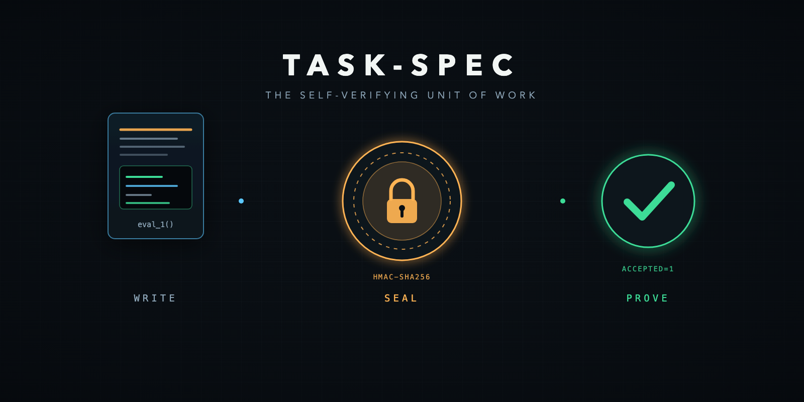
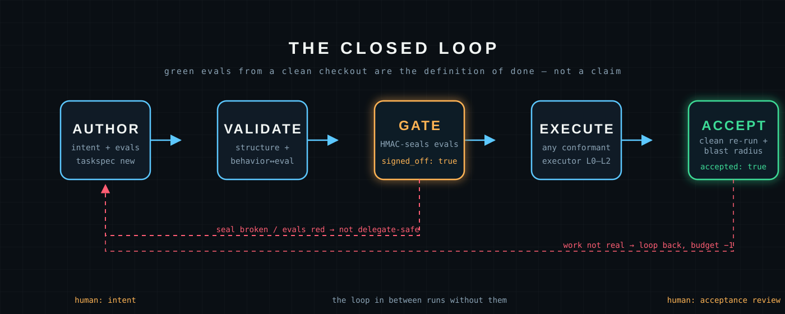
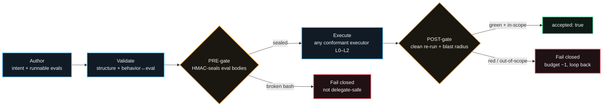

<div align="center">

[](https://github.com/luanmorenommaciel/task-spec)

<sub>A spec flows through the seal gate; green evals from a clean checkout are the only proof.</sub>

# task-spec

**Write it. Seal it. Prove it.**

*The open, atomic, self-verifying unit of work for autonomous agentic systems.*

[](spec/task-spec-v3.md)
[](VERSION)
[](spec/conformance/)
[](LICENSE)
[](https://github.com/luanmorenommaciel/task-spec/actions/workflows/ci.yml)

[Install](#install) · [Quickstart](#quickstart) · [The loop](#the-closed-loop) · [Gates](#the-dual-gates) · [CLI](#cli-map) · [Conformance](#conformance) · [Honesty](#honest-boundary)

</div>

---

## What is task-spec?

Your agents can claim the work is done. **task-spec makes them prove it.**

A task-spec is a single markdown file: YAML frontmatter + six zones + **runnable
bash evals**. An eval that runs green *is* the definition of done — not a
checklist an agent claims to have finished.

> One spec in. Verified, blast-radius-checked, accepted work out.

Two gates close the loop without trusting the executor: a PRE-gate seals the
eval bodies in an HMAC envelope and flips `signed_off: true` (delegate-safe), a
POST-gate re-runs the evals from a clean checkout, checks the blast radius, and
re-verifies the seal before stamping `accepted: true` (work-is-real). Any
executor that passes the L0/L1/L2 conformance suite can pick a spec up —
Claude, Codex, Kimi, GLM, Gemini, or a 60-line bash loop. Vendor-neutral by
construction, not by promise.

## Install

Requirements: macOS, Linux, or Linux under WSL; Bash (3.2 floor — macOS system
bash works); Git; and `shellcheck` (the PRE-gate lints every eval body with it —
ubuntu CI images ship it, on macOS `brew install shellcheck`). Optional but
recommended: `openssl` or `shasum` for the Tier-1 HMAC seal.

```bash
git clone https://github.com/luanmorenommaciel/task-spec.git
cd task-spec
ln -s "$PWD/bin/taskspec" /usr/local/bin/taskspec   # or anywhere on PATH
taskspec doctor                                      # sanity-check the toolchain

# optional: install the task-architect agent + thin skill into a repo
bash src/lib/install.sh --target /path/to/your/repo
```

## Quickstart

```bash
taskspec new verify-otel-pipeline S any notes/audit.md   # scaffold tasks/T-*.md
# ...fill the {{TODO}} stubs: title, why, goal, evals, anti-patterns...
taskspec validate tasks/T-*-verify-otel-pipeline.md      # structural linter
taskspec gate --stamp tasks/T-*-verify-otel-pipeline.md  # PRE-gate: seal + sign off
# hand the spec to any conformant executor, then:
taskspec accept --stamp tasks/T-*-verify-otel-pipeline.md  # POST-gate: prove it's real
```

## The closed loop



Read left to right: the human sets intent and writes runnable evals; the
validator enforces structure and behavior↔eval traceability; the PRE-gate seals
the eval bodies so they cannot be silently weakened after delegation; any
conformant executor does the work; the POST-gate re-proves it from a clean
checkout. Red dashed routes fail closed — a broken seal or red evals loop back
to the author, never forward. Humans anchor intent and acceptance review; the
loop in between runs without them.

<details>
<summary><strong>Portable Mermaid view</strong></summary>



</details>

The format in 60 seconds: six zones — **(1) Intent** (why / goal / context) ·
**(2) Contract** (Success Criteria as runnable `eval_N()` bash, a YAML
validation_card, an Exit Check that calls every eval) · **(3) Rollback** ·
**(4) Observability** · **(5) Guardrails** (anti-patterns, do-not-touch) ·
**(6) Operations** (open questions). A `## Behavior` section (Given/When/Then
with stable `B-N` ids) sits between intent and evals, and the validator enforces
**behavior↔eval traceability**: every behavior is verified by ≥1 eval
(`verifies: [B-N]`), every eval maps to a declared behavior. The **effort gate**
keeps atoms atomic: `XS/S/M` accepted, `L` accepted only with
`execution_backend: glm` and one coherent done-condition, `XL` refused → route
to SDD (AgentSpec / OpenSpec / SpecKit). Full spec:
[spec/task-spec-v3.md](spec/task-spec-v3.md).

## The dual gates

| | PRE-gate — `taskspec gate --stamp` | POST-gate — `taskspec accept --stamp` |
|---|---|---|
| Question | "Are these evals well-formed enough to delegate blind?" | "The executor claims done — is the work REAL?" |
| Runs evals | Yes — assertion failure is *expected* (work unbuilt); blocks only on broken bash | Yes — must PASS from a clean checkout |
| Blast radius | — | Changed files ⊆ `touches_paths`, ∩ `do-not-touch` = ∅ |
| Seal | Writes `signed_off*` + HMAC `signed_off_sig` over the eval bodies | Re-verifies the HMAC (evals not weakened post-gate) |
| Machine output | `TIER=1\|2` line (crypto trust / structural-only) | `ACCEPTED=1\|0`, stamps `accepted: true` |
| Opt-ins | `--require-tier1` (CI: no Tier-2 unsupervised) | `--gold-sanity` (evals must FAIL on the unpatched baseline) |

## For coding agents

`bin/taskspec` is a stable machine contract: fixed subcommand names, exit codes
(`0` success · `1` underlying check failed · `2` usage), `taskspec run --ci`
emitting one JSON object per eval on stdout, `taskspec doctor` for environment
self-checks. Integrations: [Claude Code skill](integrations/claude-code/),
[GitHub Action](integrations/github-action/) (the CI eval-gate — the merge gate
stops trusting agent-pasted GREEN), [Codex AGENTS.md](integrations/codex/AGENTS.md).

## CLI map

```text
taskspec new <slug> <effort> [agent] [source]   Scaffold a T-*.md spec
taskspec batch --intent-file <f> --effort S|M   Bulk-create N stub specs
taskspec migrate <spec>                         Legacy checklist → evals
taskspec validate [opts] <spec>                 Structural linter (no stamping)
taskspec gate [--stamp] [--require-tier1] <sp>  PRE-gate: go/no-go to delegate
taskspec run [--ci] <spec>                      Execute evals; --ci = JSON/eval
taskspec accept [--stamp] [--gold-sanity] <sp>  POST-gate: prove work is REAL
taskspec ready | transition | lint | archive    Backlog operations
taskspec conformance --level L0|L1|L2 --executor "<cmd>"
taskspec conformance --self-test                Against the bundled ref executor
taskspec doctor                                 Toolchain + signing-key check
taskspec version                                Print the engine version
```

Exit-code contract: `0` success · `1` the underlying check failed · `2` usage.

## Conformance

"Any conformant executor can pick it up" is testable, not aspirational:
**L0** reads the format and runs the evals · **L1** honors the status lifecycle
(ready → in-progress → done) · **L2** honors the retry budget (parks instead of
looping forever). The suite, fixtures, and vendoring protocol live in
[spec/conformance/](spec/conformance/); `taskspec conformance --self-test` runs
the bundled reference executor.

## Verified surface

The single release gate is:

```bash
make check
```

It runs `taskspec doctor`, the doc-consistency lint, the docs/link lint, every
`tests/test-*.sh` self-test (bash portability, extractor fuzz, HMAC envelope,
portability E2E, closed-loop E2E), and the L0–L2 conformance suite against the
bundled reference executor. The checked-in CI workflow runs that same
credential-free boundary on Ubuntu and macOS — CI runs the same gate you run
locally, nothing more. The multi-engine matrix of [TODO.md](TODO.md) P0-1
(real Claude/Codex executors in CI) builds on this foundation and remains open.

## Honest boundary

| Claim | The truth |
| --- | --- |
| Green evals | Prove what they assert, nothing more. `--gold-sanity` exists because always-true evals pass on the unpatched baseline too. |
| HMAC envelope | Tamper-**evident** (proves eval bodies weren't edited after the gate), not tamper-**proof** (a repo-key holder can reseal). |
| Vendor neutrality | A testable property — L0/L1/L2 conformance — not a promise. Real-engine CI evidence (P0-1) is still landing. |
| Humans in the loop | Yes, by design: at intent-setting and acceptance review. The loop in between runs without them. |
| Package managers / Homebrew / curl installer | Not claimed yet — git clone + symlink is the install (see TODO P2-5). |

Roadmap: [TODO.md](TODO.md) and [docs/roadmap.md](docs/roadmap.md).

## Repository guide

- [`spec/task-spec-v3.md`](spec/task-spec-v3.md) — the normative format spec
- [`spec/schemas/`](spec/schemas/) — JSON Schemas (the machine contract)
- [`spec/conformance/`](spec/conformance/) — L0/L1/L2 suite, fixtures, vendoring protocol
- [`bin/taskspec`](bin/taskspec) — canonical CLI (stable subcommands + exit codes)
- [`src/`](src/) — engine scripts by verb: author / gate / accept / backlog / dispatch / lib
- [`docs/`](docs/) — authoring doctrine, concepts, patterns, runbooks, examples
- [`agents/task-architect.md`](agents/task-architect.md) — the authoring agent; [`templates/`](templates/) spec template
- [`adapters/`](adapters/) — per-engine dispatch recipes + trackers (**non-normative**)
- [`integrations/`](integrations/) — Claude Code skill · GitHub Action · Codex
- [`fixtures/diamond-6/`](fixtures/diamond-6/) — 6-task dependency-diamond backlog used by CI
- [`tests/`](tests/) — the self-test suite; [`evals/`](evals/) benchmark cases
- [`assets/taskspec-mark.svg`](assets/taskspec-mark.svg) — reusable page-and-seal mark
- [`assets/taskspec-logo.svg`](assets/taskspec-logo.svg) — horizontal wordmark lockup

## License

MIT — © 2026 Luan Moreno. See [LICENSE](LICENSE).
