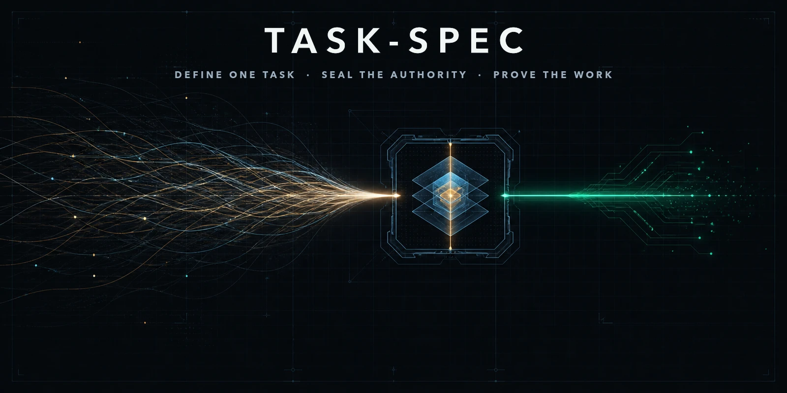
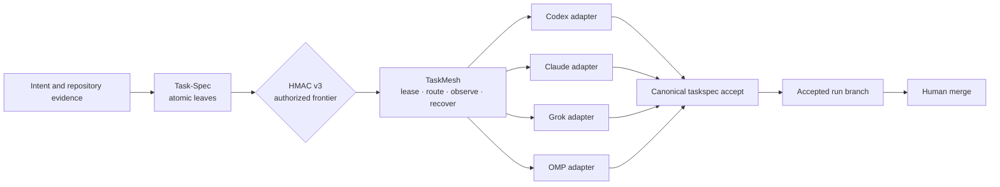
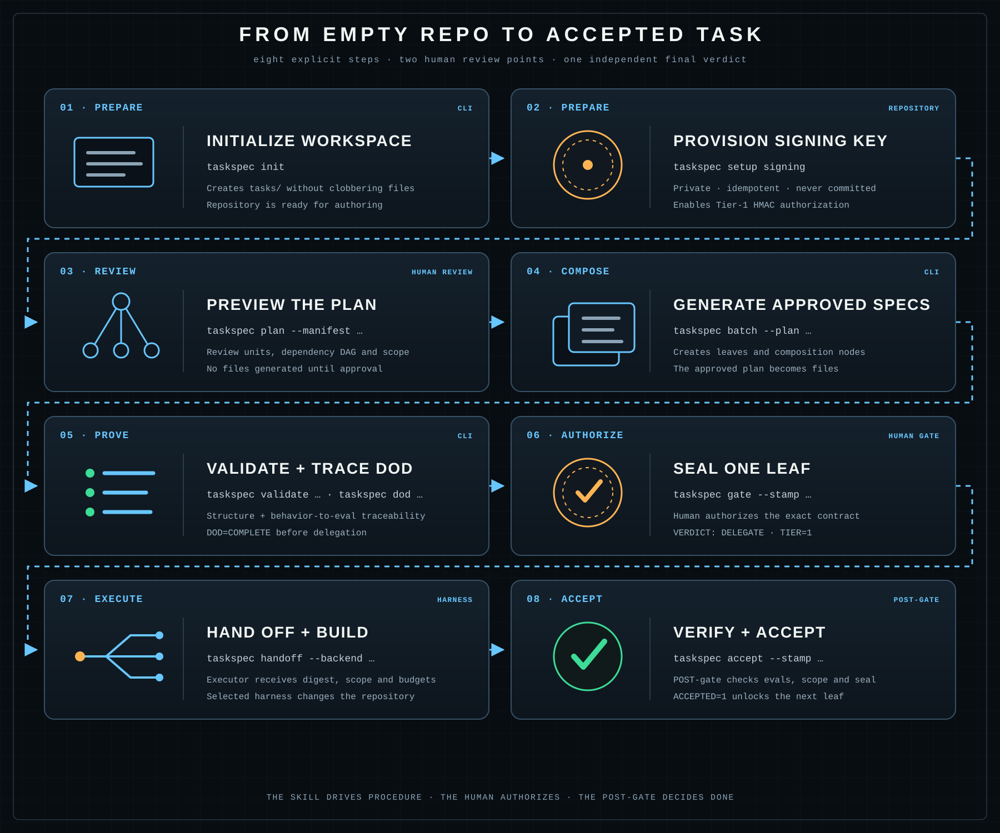
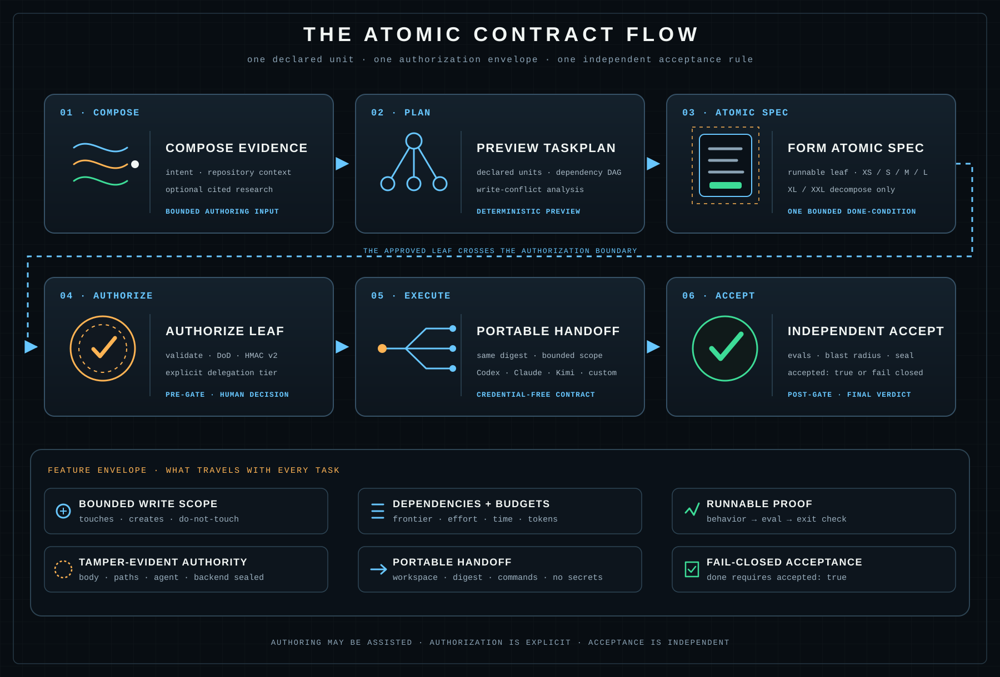
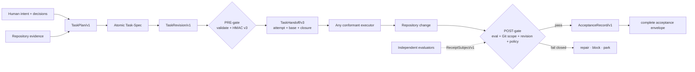
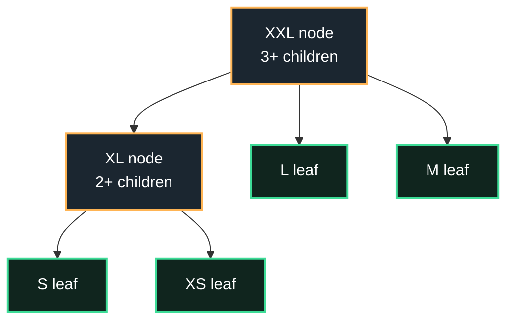

<div align="center">

[](https://github.com/luanmorenommaciel/task-spec)

<h1>Task-Spec</h1>

<p><strong>Agents can write code. Task-Spec makes them earn <code>done</code>.</strong></p>
<p>One open contract for bounded scope, executable proof, sealed authority,<br/>portable handoff, and independent acceptance.</p>

[](CHANGELOG.md)
[](spec/task-spec-v4.md)
[](#requirements)
[](#verified-status)
[](LICENSE)

Works with **Codex · Claude Code · Kimi · Grok Build · any conformant executor**

[Prove it](#prove-it-in-one-command) ·
[Review](#review-it-in-five-minutes) ·
[TaskMesh](#taskmesh-the-optional-execution-control-plane) ·
[Highlights](#what-shipped-in-39) ·
[Features](#feature-matrix) ·
[Install](#installation) ·
[Use it](#step-by-step-usage) ·
[Architecture](#how-it-works) ·
[Trust](#trust-boundaries) ·
[Docs](#documentation)

</div>

---

## The missing contract between intent and execution

A prompt tells an agent what you want. A Task-Spec also records what the agent
may change, what observable behavior counts as success, what evidence must
exist, who authorized that exact contract, and what an independent gate must
verify afterward.

| Without Task-Spec | With Task-Spec |
|---|---|
| “Implement search and test it.” | One atomic leaf with explicit paths, behavior, evals, budget, and owner |
| The agent decides what “done” means while working | Humans review the contract; runnable evals decide the technical result |
| Scope changes disappear into the conversation | HMAC v3 seals a canonical task revision—including future fields by default |
| Every harness receives a different interpretation | Every harness receives the same attempt, revision, base commit, closure, scope, and budget |
| “Tests pass” is the final claim | Acceptance reruns proof, checks Git history and the worktree, binds receipts, and writes an auditable record |

The Task-Spec core deliberately stops at this boundary. It does not host models,
store credentials, create a sandbox, or turn a weak eval into a wise oracle.
Version 3.9 adds **TaskMesh** as an optional runtime: it can route and execute
already-authorized leaves, but it cannot change the contract or accept work on
its own terms.

## Prove it in one command

After installation, run a complete lifecycle in a disposable repository:

```console
$ taskspec demo
Task-Spec isolated lifecycle
  PLAN=VALID
  DOD=COMPLETE
  VERDICT=DELEGATE TIER=1
  HANDOFF=TaskHandoff/v3
  EVAL=PASS
  ACCEPTED=1
DEMO=READY
```

`taskspec demo` creates an isolated Git repository, writes and validates a real
`TaskPlan/v1`, generates one atomic leaf, seals it, emits a portable handoff,
runs its eval, accepts the result, and removes the repository. It does not touch
the repository from which you invoke it.

That command is exercised by `make check`; tagged releases also have a separate
remote-install workflow that verifies the checksum-backed release assets and
authenticated npm/GitHub installation on both Ubuntu and macOS.

## Review it in five minutes

The installed package carries its canonical TaskPlan example, so a reviewer no
longer needs to copy a checkout-relative sample path:

```bash
mkdir -p tasks/.plans
taskspec agent-context
taskspec example task-plan --out tasks/.plans/reviewer.yaml
taskspec plan --manifest tasks/.plans/reviewer.yaml
```

From the corresponding tagged source checkout, verify local behavior, retained
evidence, the generated README projection, and then the stricter release gate:

```bash
make check
python3 src/evidence/release_audit.py check
python3 tools/render-status.py --check README.md
make release-audit
```

During development, `make release-audit` is expected to fail with named
`BLOCKED` tokens. Publication requires digest-backed proof for every blocking
criterion and `QUALITY_SCORE=97`; unavailable evidence earns zero. The complete
[reviewer route](docs/getting-started/reviewer-route.md) explains exactly what
each evidence class proves—and what it does not.

## What shipped in 3.9

TaskMesh turns the safe frontier into an observable, recoverable run without
turning runtime state into authority. The cockpit can be Codex today and Claude
or Grok tomorrow; the daemon, lease, attempt, and evidence remain the same.



| TaskMesh capability | What happens | Hard boundary |
|---|---|---|
| **Durable cockpit** | One repository daemon retains ordered runs and events across Codex, Claude, Grok, or MCP clients | The cockpit is not the runtime owner |
| **Deterministic routing** | Eligible adapters are filtered by scope, tools, mode, capacity, and policy; every rejection is recorded | An advisor may reorder only eligible candidates |
| **Leases and fencing** | Every leaf receives one authoritative attempt and monotonically increasing fence | Exactly-once provider execution is not claimed |
| **Worktree integration** | Accepted attempts merge into a TaskMesh run branch | The user target branch is never mutated or pushed |
| **Supervised adapters** | Codex, Claude Code, Grok Build, and OMP receive one `TaskHandoff/v3` | Worktrees are not called security sandboxes |
| **Autonomous OMP** | A pinned container receives one workspace and one expiring attempt capability | No silent downgrade when isolation cannot be proven |
| **Canonical acceptance** | TaskMesh invokes the same revision-, attempt-, base-, scope-, and receipt-bound POST-gate | TaskMesh cannot hand-edit `accepted: true` |

TaskMesh does not depend on Omnigent, create a second graph database, decompose
work, invent runtime dependencies, or hide OMP subagent fan-out. Read the
[five-minute TaskMesh journey](docs/getting-started/taskmesh.md),
[runtime contracts](docs/reference/taskmesh-contracts.md), and
[trust boundaries](docs/trust/taskmesh-boundaries.md).

## The 3.8 trust foundation

Version 3.8 finishes the trust chain introduced by format v4 without creating a
format v5. Format v3 is still the authoring default; formats v1–v4 remain
readable. What changes is the identity of an authorized attempt: task revision,
authorization, handoff, dependency closure, receipts, Git base, and acceptance
now have to describe the same thing.

| Highlight | What it adds | Why it matters |
|---|---|---|
| **TaskRevision/v1** | body plus a canonical authority manifest | Unknown future fields are sealed unless explicitly operational and mutable |
| **HMAC v3** | authorization of that exact task revision | v1/v2 stay readable but cannot silently regain Tier 1 |
| **TaskHandoff/v3** | UUID attempt, immutable Git base, revision and dependency closure | A receipt from another attempt, rebase, or edited dependency cannot be replayed |
| **ReceiptSubject/v1** | task, revision, authorization, attempt, and base commit | Independent evidence is bound to one execution subject |
| **Commit-aware acceptance** | committed, staged, unstaged, and untracked changes plus symlink-safe paths | Executors cannot hide out-of-scope work in a commit or escaped path |
| **AcceptanceRecord/v1** | atomic gate results, stable outcome codes, receipt digests, tier, acceptor, and timestamp | `status`, doctor, and transition verify the durable record instead of trusting a bare boolean or hash |
| **TaskGraphView/v1** | recursive lifecycle scan, cycles, blockers, exact closures, collisions, frontier, and groups | Markdown and Git stay canonical while every lifecycle command shares one graph |
| **Status and recovery** | one read-only status object, one safe next command, backlog doctor | Narrow seals, stale projections, orphan records, and interrupted writes become visible |
| **Optional interop** | signed v2 receipts, DSSE export, digest-bound A2A v1.0/MCP bridges, provider smoke evidence | Integration grows without becoming a normative transport or trust dependency |

The historical nine-family matrix remains a disabled harness—not a nine-provider
claim. The 3.8.1 release corridor is narrower and evidence-backed: three frozen
XS/S/M leaves each ran once through Codex CLI 0.147.0 with `gpt-5.6-sol` and
Claude Code 2.1.233 with observed model `claude-opus-5`; all six attempts were
independently accepted with zero write-scope violations. That synthetic result
demonstrates these two engine families on this corridor, not production
reliability or every provider. The retained result is
[`EngineMatrixResult/v2`](release/3.8.1/engine-matrix-result.json).

## Five reasons to use Task-Spec

1. **Bound the work.** `touches_paths`, `creates_paths`, Do-Not-Touch, effort,
   dependencies, and budgets define the executor's authorized surface.
2. **Make proof executable.** Every behavior maps to at least one eval, every
   eval maps back to behavior, and the Exit Check is the terminal condition.
3. **Seal authority.** Only the PRE-gate writes `signed_off*`; changing the
   approved body or sealed authority manifest breaks the HMAC v3 seal.
4. **Change the player, not the contract.** Codex, Claude Code, Kimi, Grok, or a
   conformant custom executor receives the same handoff.
5. **Accept independently.** Only the POST-gate writes `accepted*`, after evals,
   scope, seal integrity, and any v4 evidence policy pass.

## Feature matrix

| Surface | Capability | Deterministic proof |
|---|---|---|
| Atomic authoring | v3/v4 scaffolds, approved `TaskPlan/v1`, Task-Spec-owned `TaskMaterializationReceipt/v1` | `taskspec plan`, `batch`, `validate` |
| Behavior contract | Given/When/Then IDs with bidirectional eval traceability | `taskspec dod` → `DOD=COMPLETE` |
| Scope control | bounded read/write surfaces and Do-Not-Touch rules | PRE-gate validation + POST-gate blast-radius check |
| Authorization | HMAC v3 over `TaskRevision/v1`; unknown fields sealed by default | `taskspec gate --stamp` → `TIER=1` |
| Portable handoff | credential-free `TaskHandoff/v3` with attempt, Git base, and closure | `taskspec handoff --backend … --out …` |
| Independent acceptance | eval rerun, repository audit, seal, closure, and receipt policy | `taskspec accept --handoff … --stamp` → `ACCEPTED=1` |
| Eval quality | author warnings, baseline checks, mutation discrimination | `author-doctor`, `eval-audit`, `--gold-sanity` |
| Independent evidence | holdouts, typed receipts, environment and human evidence | `holdout`, `receipt`, v4 Gate F |
| Identity | optional Ed25519 evidence attribution and revocation | `taskspec identity verify` |
| Derived graph | dependencies, composition, supersession, conflicts, closures, safe frontier | `taskspec graph --check`, `ready --all` |
| Recovery and status | one lifecycle view and one safe next action | `taskspec status`, `doctor --backlog` |
| Multi-engine experiments | isolated worktrees, exact model IDs, retained run receipts | `taskspec evidence validate|plan|run` |
| Interoperability | optional A2A v1.0/MCP bridges and DSSE receipt export | `taskspec bridge`, `dsse`, `mcp` |
| Agent ergonomics | one installed skill across four harness destinations | installer equivalence checks |
| Optional execution control | durable leases, deterministic routing, multi-harness adapters, recovery, and run-branch integration | `taskspec mesh …`, TaskMesh conformance and demo corridors |
| Automation | JSON envelope, dry-run, stable tokens, shell completion | `--json`, `--dry-run`, `agent-context` |
| Portability | Bash 3.2 core, standard-library Python, offline by default | `make check`, conformance L0–L2 |
| Contract consistency | Draft 2020-12 schemas with local-reference and generated-fixture validation | `tests/test-schema-contracts.sh` |

## Installation

### Authenticated source checkout

The repository and release remain private. Authenticate GitHub before cloning:

```bash
git clone --depth 1 https://github.com/luanmorenommaciel/task-spec.git \
  "$HOME/.local/share/task-spec-src"

# User-level: Codex/Kimi, Claude Code, Grok Build, and the taskspec CLI
bash "$HOME/.local/share/task-spec-src/install.sh" --global --copy
export PATH="$HOME/.local/bin:$PATH"
taskspec doctor
taskspec demo
```

Add the optional TaskMesh helper when this checkout has Go available:

```bash
bash "$HOME/.local/share/task-spec-src/install.sh" --global --copy --with-mesh
taskspec mesh doctor
```

Use a repository-local installation when a project should carry its own skill
copies:

```bash
cd /path/to/your/repository
bash "$HOME/.local/share/task-spec-src/install.sh" --target "$PWD" --copy
```

The installer ends with `INSTALL=OK` only after the installed engine reports the
expected version, all harness skill copies match the canonical skill, and the
CLI launcher resolves to that same engine.

### Pinned private release archive

Private release doors use your existing GitHub authorization rather than
anonymous raw URLs. Download only the core archive for Task-Spec alone, or add
the TaskMesh helper assets for the optional control plane:

```bash
gh auth status
release_dir="$(mktemp -d)"
gh release download v3.9.0 \
  --repo luanmorenommaciel/task-spec \
  --pattern 'task-spec-3.9.0.tar.gz*' \
  --pattern 'taskspec-meshd-*' \
  --dir "$release_dir"
(cd "$release_dir" && shasum -a 256 -c task-spec-3.9.0.tar.gz.sha256)
tar -xzf "$release_dir/task-spec-3.9.0.tar.gz" -C "$release_dir"
bash "$release_dir/task-spec-3.9.0/install.sh" --global --copy --with-mesh
```

```bash
gh auth setup-git
npm install -g git+https://github.com/luanmorenommaciel/task-spec.git#v3.9.0
taskspec-install --global --with-mesh
```

Anonymous raw-file and release-asset URLs are not installation doors while the
repository is private. The hosted release smoke uses the same authenticated
Contents, release-asset, and Git transports shown above.

### Claude marketplace

```text
/plugin marketplace add luanmorenommaciel/task-spec
/plugin install task-spec@taskspec
```

The shell installer gives every supported harness the same contract:

| Harness | User-level destination | Repository-local destination |
|---|---|---|
| **Codex** | `~/.agents/skills/task-spec/` | `.agents/skills/task-spec/` |
| **Kimi** | `~/.agents/skills/task-spec/` | `.agents/skills/task-spec/` |
| **Claude Code** | `~/.claude/skills/task-spec/` | `.claude/skills/task-spec/` |
| **Grok Build** | `~/.grok/skills/task-spec/` | `.grok/skills/task-spec/` |

Claude also receives the legacy-compatible `task-architect` entrypoint. The CLI
is installed under `~/.local/bin/taskspec` unless `--bin-dir` overrides it.

### Installation guarantees

| Guarantee | Behavior |
|---|---|
| Non-clobbering | Existing unmanaged destinations are refused by default |
| Idempotent | Reinstalling the same managed version keeps valid destinations |
| Recoverable upgrade | `--force` backs up replaced managed paths with a UTC suffix |
| Pinned engine | Versions install side by side under `~/.local/share/task-spec/` |
| Harness parity | Installed skill content is compared with the canonical source |
| Credential safety | No model or provider credential is installed, copied, or requested |
| Verifiable | Engine and launcher version checks run before `INSTALL=OK` |
| Immutable release | Remote archive SHA-256 is verified before extraction |
| Optional runtime | `--with-mesh` verifies the platform helper checksum and exact Task-Spec version |
| Prove-before-use | `taskspec demo` exercises the complete lifecycle in isolation |

<details>
<summary><b>Installer controls and requirements</b></summary>

```text
--global           install user-level skills for every supported harness
--target DIR       repository receiving harness skills
--copy             pinned, non-clobbering copy installation (default)
--symlink          local checkout-development mode
--bin-dir DIR      CLI launcher directory (default: ~/.local/bin)
--no-bin           install skills only
--with-mesh        install the matching optional TaskMesh helper
--force            back up and replace managed destinations
```

### Requirements

- Bash 3.2+
- Git
- Python 3
- `shellcheck` for the PRE-gate and `taskspec demo`
- OpenSSL, `shasum`, or `sha256sum` for Tier-1 HMAC
- Node 18+ only for the npm installation door
- Go 1.25+ only when building TaskMesh from a source checkout
- Docker or Podman only for autonomous OMP execution

</details>

## Step-by-step usage

Everything below happens inside the repository you want to change. The first
task should be XS or S and supervised; calibrate eval quality before increasing
autonomy.



### 1. Prepare the repository

```bash
taskspec init
taskspec setup signing
taskspec doctor
```

`init` creates only missing Task-Spec workspace files. The signing key lives in
the repository's private Git common directory and never enters a handoff.

### 2. Ask for a plan, not files

Use the installed skill from chat:

```text
Turn “add repository search” into atomic Task-Specs. Inspect the repository,
show me the TaskPlan first, and do not generate files until I approve it.
```

The expected boundary is a complete `TaskPlan/v1`: atomic units, dependencies,
write surfaces, behaviors, evals, budgets, and open questions. Approval of the
plan is separate from authorization to execute a leaf.

### 3. Preview, approve, and generate

```bash
taskspec plan --manifest tasks/.plans/add-search.yaml
taskspec batch --plan tasks/.plans/add-search.yaml
```

`plan` is read-only. `batch` refuses an unapproved, malformed, cyclic, or
credential-bearing manifest. With global `--json`, `batch` returns a
`TaskMaterializationReceipt/v1` binding the input digest to every generated
path and content hash; materialization never grants dispatch authority.
An exact rerun returns `state: unchanged` and `changed: false`. A partial task
set or any conflicting existing bytes fails closed instead of overwriting work.

### 4. Inspect the contract and its proof graph

```bash
taskspec validate tasks/T-…-add-search.md
taskspec dod tasks/T-…-add-search.md
taskspec author-doctor tasks/T-…-add-search.md
```

Do not continue until structure is valid, `DOD=COMPLETE`, and every unresolved
semantic decision has an accountable owner or a blocked status.

### 5. Authorize exactly one ready leaf

```bash
taskspec gate --stamp tasks/T-…-add-search.md
taskspec handoff tasks/T-…-add-search.md --backend codex \
  --out .taskspec/handoffs/add-search.json
```

The gate writes the HMAC seal. The handoff is read-only, digest-bound, and
credential-free. A v4 leaf includes public evidence and environment commitments
without revealing private holdout commands.

### 6. Execute with the chosen harness

Give the handoff to Codex, Claude Code, Kimi, Grok Build, or a conformant custom
executor. The player may change; the authorized paths, budgets, behaviors, and
eval commands do not.

### 7. Accept independently

```bash
taskspec run tasks/T-…-add-search.md
taskspec accept --stamp --gold-sanity \
  --handoff .taskspec/handoffs/add-search.json \
  tasks/T-…-add-search.md
taskspec transition T-…-add-search done
```

Acceptance reruns the Exit Check, compares every committed and uncommitted
change with the handoff's immutable Git base, verifies the revision and graph
closure, applies v4 receipt policy, and writes `AcceptanceRecord/v1` before the
complete acceptance envelope. A task cannot transition to `done` first.
With global `--json`, success returns `AcceptanceFinalized/v1`, binding the task
and attempt to the exact acceptance-record path and digest for external
schedulers such as Workhelm.

### 8. Expose the next safe frontier

```bash
taskspec ready --all
taskspec graph --check
taskspec status T-…-add-search
```

The graph is a deterministic projection of Markdown and Git: it reports
dependency-unblocked leaves, collisions, cycles, closure drift, supersession,
and write-disjoint groups. `status` returns exactly one safe next command.
Task-Spec still does not choose or schedule the frontier.

### 9. Optionally execute the frontier with TaskMesh

When `--with-mesh` is installed, the same authorized frontier can become a
durable multi-harness run:

```bash
taskspec mesh frontier
taskspec mesh explain --task T-…-add-search
taskspec mesh run --task T-…-add-search --adapter codex-native --execute
taskspec mesh watch <run-id>
```

The daemon routes only authorized ready leaves, fences every attempt, and keeps
the target branch untouched. Supervised work stops at `awaiting_supervision`;
autonomous OMP additionally requires verified sandbox and credential evidence.

## Choose the evidence level

| Need | Use | Acceptance boundary |
|---|---|---|
| Normal repository change with strong runnable evals | **Format v3** (default) | evals + blast radius + HMAC integrity |
| Hidden evaluator or benchmark | **v4 · holdout** | sealed holdout receipt bound to task and handoff |
| Subjective quality with a rubric | **v4 · graded** | graded receipt from the declared evaluator |
| Accountable semantic approval | **v4 · human** | named human acceptance receipt |
| Portable environment claim | **v4 · environment contract** | observed environment receipt matches the commitment |

```bash
taskspec new add-search S codex
taskspec new --format 4 benchmark-search S codex
```

Use v4 because the evidence source must be independent—not because a task looks
important. Structural validity never replaces semantic human review.

## Inside one atomic task

One Task-Spec aligns four layers:

| Layer | Fields and sections | What it controls |
|---|---|---|
| **Bounded workspace** | `touches_paths`, `creates_paths`, Do-Not-Touch | Where the executor may write and what acceptance must reject |
| **Execution contract** | goal, context, dependencies, effort, backend, agent contract, budgets | What the unit means and how much autonomy it receives |
| **Executable proof** | behaviors, success criteria, runnable evals, Exit Check | What observable outcome counts as success |
| **Authorization envelope** | `TaskRevision/v1`, `signed_off*`, `hmac-sha256-v3` | Whether body and the complete sealed authority still match human sign-off |

The strongest invariant is bidirectional traceability: every `B-N` behavior is
verified by at least one eval, and every eval points back to at least one
behavior. Neither side may dangle.

## How it works





TaskMesh sits between the ready handoff and the executor only when installed.
It adds runtime leases and observation; it never bypasses either gate.

| Moment | Owner | Output | What is actually proven |
|---|---|---|---|
| Compose | author + human | plan and atomic specs | declared work, dependencies, and proof are explicit |
| PRE-gate | deterministic gate | sign-off seal and tier | the exact contract is structurally ready and tamper-evident |
| Handoff | dispatcher | v3 JSON contract | each executor receives the same revision, attempt, base, closure, scope, budget, and commands |
| Execution | selected harness | repository change | an authorized attempt occurred; success is not implied |
| Evidence | independent surfaces | typed receipts | named evaluators reported results bound to the task |
| POST-gate | acceptance gate | record + acceptance envelope | configured proof, repository scope, revision, closure, and policy passed or failed |

## Atomic leaves and composition nodes



| Size | Kind | Write-surface guidance | Dispatch rule |
|---|---|---:|---|
| XS | Leaf | ≤1 path | Runnable |
| S | Leaf | ≤2 paths | Runnable |
| M | Leaf | ≤3 paths | Runnable |
| L | Leaf | ≤5 paths | Long-horizon backend; one coherent done-condition |
| XL | Node | No writes | At least 2 children; never delegated |
| XXL | Node | No writes | At least 3 children; never delegated |

Nodes compose; leaves execute. If a leaf exceeds its coherent write surface or
done-condition, decompose it instead of hiding more autonomy inside the prompt.

## Trust boundaries

| Claim | Honest boundary |
|---|---|
| HMAC v3 | Tamper-evident shared-key authorization of `TaskRevision/v1`; not identity, non-repudiation, or isolation |
| Runnable evals | Deterministic evidence when well designed; no validator can make a weak oracle wise |
| `TaskHandoff/v3` | Revision- and attempt-bound transfer contract; optional bridge exports digest the complete handoff; it does not invoke a model or schedule workers |
| v2 receipts | Reports bound to one revision, authorization, attempt, and base commit; not universal correctness |
| Ed25519 receipt | Optional signer attribution and revocation; not authorization policy by itself |
| `accepted: true` | The configured POST-gate passed; not proof of deployment or production health |
| Conformance L0–L2 | An adapter honors format and lifecycle behavior in the suite; not fleet reliability |
| Release smoke CI | Published checksum assets and authenticated npm/GitHub doors install and pass the isolated demo; it does not test provider credentials |
| TaskMesh supervised mode | Durable leases, bounded worktrees, adapters, and explicit human acceptance; not hostile-code isolation |
| TaskMesh autonomous mode | Attempt-bound container, credential, and host-attestation evidence; not universal sandbox security or production reliability |

Legacy HMAC v1/v2 seals remain readable on their original terms but are narrowed
to supervised Tier 2 until individually re-stamped with v3. Read
[Trust and security](docs/trust/index.md) before using unsupervised Tier 1.

## CLI map

| Stage | Commands | Mutation boundary |
|---|---|---|
| Prove the install | `doctor`, `demo`, `conformance --self-test` | demo/conformance use disposable fixtures only |
| Prepare | `init`, `setup`, `setup signing` | non-clobbering workspace and private key setup |
| Compose | `plan`, `batch --plan`, `new`, `migrate` | preview is read-only; generation is explicit |
| Prove before work | `validate`, `dod`, `author-doctor`, `gate --stamp` | only the gate writes `signed_off*` |
| Transfer | `handoff --backend … --out …`, `agent-context` | read-only machine contracts; never credentials |
| Execute | `run`, any conformant harness | evals run relative to the task workspace |
| Prove after work | `accept --handoff … --stamp`, `transition … done` | only acceptance writes the complete envelope; done requires it |
| Strengthen evidence | `holdout`, `receipt`, `eval-audit`, `identity` | explicit evidence paths; v4 fails closed when required proof is missing |
| Interoperate | `bridge`, `dsse`, `mcp`, `evidence` | optional exports; read-only by default; runs retain receipts |
| Operate | `ready`, `graph`, `status`, `doctor --backlog`, `rebuild-state` | deterministic views, recovery, and one safe next action |
| Orchestrate optionally | `mesh frontier`, `run`, `watch`, `accept`, `finish`, `mcp` | leased runtime overlay; canonical task authority and target branch remain external |

Global `--json` wraps results in `TaskSpecCLIResult/v1`; global `--dry-run`
prevents supported mutations and reports intent. `NO_COLOR` or
`TASKSPEC_COLOR=0` disables ANSI. `taskspec agent-context` exposes the complete
machine-readable command and token contract.

## Verified status

<!-- release-status:start -->
| Surface | Repository evidence | Status |
|---|---|---|
| Evidence-derived score | Only digest-matching retained artifacts earn points | **97/100**; target 97; release gate passed |
| Contract and trust | Revision-bound authorization, compatibility, and the explicit HMAC boundary | 24/25 |
| Lifecycle and recovery | Nested workspaces, graph recovery, atomic acceptance, and replay resistance | 25/25 |
| Documentation and DX | Installed reviewer route, executable docs, and generated status | 20/20 |
| Harness and packaging | All installation doors plus frozen Codex and Claude execution | 10/10 |
| Standards interoperability | Pinned official A2A and MCP SDK conformance | 9/10 |
| Private distribution and external proof | Hosted CI, private signed provenance, authenticated installs, and externally signed sandbox evidence | 9/10 |
| Publication | Task-Spec 3.8.1 at `351c39908ca0` | Published |
| Deliberately unclaimed | Semantic truth, ecosystem-wide certification, and long-running production reliability | 3 points remain unavailable by design |
<!-- release-status:end -->

The canonical status sources are the fixed
[quality rubric](release/quality-rubric.json), retained
[release evidence](release/evidence.json), and generated
[scorecard](release/3.8.1/scorecard.json). Missing, pending, unavailable, or
digest-mismatched proof earns zero. `make release-audit` recalculates the score
and fails until every blocking criterion is supported and the total reaches 97.
`make check` is the single local and normal-CI boundary. It ends with
`CHECK=READY` only when doctor, documentation lint, every self-test, the
isolated demo, and conformance are green.

TaskMesh 3.9 has a separate proof corridor. A releasable commit must emit
`MESH_CONFORMANCE=READY`, `MESH_RECOVERY=READY`, `MESH_ISOLATION=READY`,
`MESH_DEMO=READY`, and `MESH_INSTALL=READY` while the historical quality audit
still emits `QUALITY_SCORE=97`. These tokens count only when their commands ran
and their retained artifacts match; a missing container runtime is
`UNAVAILABLE`, never a pass.

Hosted status is reported separately from local evidence. The 3.8.1 repository
gate passed on Ubuntu and macOS in run
[`31966151781`](https://github.com/luanmorenommaciel/task-spec/actions/runs/31966151781).
The immutable private `v3.8.1` archive, signed provenance, authenticated
installation passed on both systems in run
[`31967301689`](https://github.com/luanmorenommaciel/task-spec/actions/runs/31967301689).
The 3.9 TaskMesh hosted run is recorded separately in its retained release
evidence rather than inferred from these historical results.

## Documentation

| Start here | Best for |
|---|---|
| [Getting Started](docs/getting-started/index.md) | installation, signing, and the first accepted task |
| [TaskMesh](docs/getting-started/taskmesh.md) | optional routing, execution, cockpit transfer, and safe integration |
| [Guides](docs/guides/index.md) | repository scans, research evidence, multi-engine execution, and recovery |
| [Reference](docs/reference/index.md) | CLI, contracts, schemas, TaskPlan, TaskHandoff, and AuthoringEvidence |
| [Trust](docs/trust/index.md) | HMAC limits, eval gaming, supervision tiers, blast radius, and conformance |
| [Examples](docs/examples/) | leaves, composition nodes, evidence bundles, and portable handoffs |
| [Format v3](spec/task-spec-v3.md) | stable standalone Task-Spec contract |
| [Format v4](spec/task-spec-v4.md) | opt-in evidence, identity, and environment policy |
| [Conformance](spec/conformance/README.md) | what an adapter must prove at L0, L1, and L2 |
| [Changelog](CHANGELOG.md) | compatibility and engine history |

## FAQ

<details>
<summary><b>Does my coding agent need native Task-Spec support?</b></summary>

No. The installed skill is markdown plus scripts. Any harness that can discover
the skill and invoke shell commands can drive the lifecycle. The deterministic
CLI remains the referee.
</details>

<details>
<summary><b>Why sign a task instead of relying only on Git history?</b></summary>

Git records that bytes changed. HMAC v3 records that `TaskRevision/v1`—the body
plus every sealed authority field—still matches what a human reviewed. The
handoff then binds that revision to an attempt and immutable Git base.
</details>

<details>
<summary><b>Does Task-Spec run many agents or schedule a fleet?</b></summary>

The core does not: it defines, authorizes, hands off, and accepts one atomic
leaf. Optional TaskMesh can lease and route a bounded ready frontier across
Codex, Claude, Grok, or OMP, but it cannot decompose tasks, create dependencies,
widen scope, or merge the user's target branch.
</details>

<details>
<summary><b>Can I add it to an existing repository?</b></summary>

Yes. The installer and `taskspec init` are non-clobbering by default. Start with
one supervised XS or S task, inspect every artifact, and calibrate eval quality
before granting more autonomy.
</details>

<details>
<summary><b>Does accepted mean deployed?</b></summary>

No. It means the configured acceptance contract passed in the observed
environment. Deployment and production verification need their own tasks,
evidence, and owners.
</details>

## Provenance

Task-Spec was extracted from Converge and owns the canonical format, schemas,
engine, CLI, skill, installer, examples, and conformance suite. The immutable
donor baseline is `converge@f78f077`; the portable mapping is recorded in
[the donor map](docs/reference/converge-donor-map.md). Converge remains the
higher-level methodology and runtime for intent shaping, coordination, loops,
receipts, and future management.

## Contributing

```bash
make check
```

Format changes are triple-locked: schema, conformance fixture, and changelog.
The core gate path stays compatible with macOS Bash 3.2. See
[AGENTS.md](AGENTS.md) for repository conventions.

## License

[MIT](LICENSE) — one open contract, any conformant executor.
