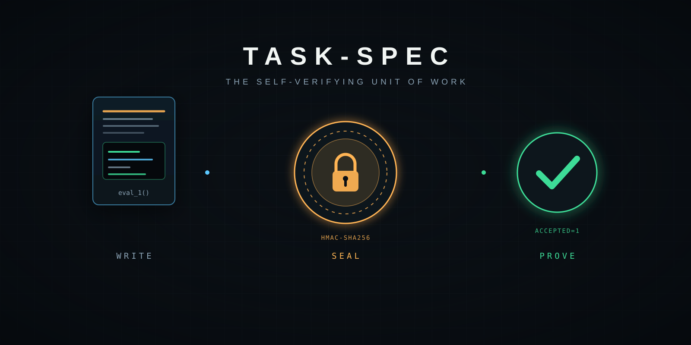
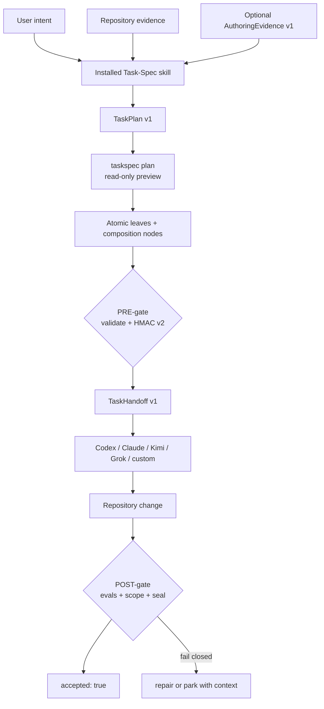
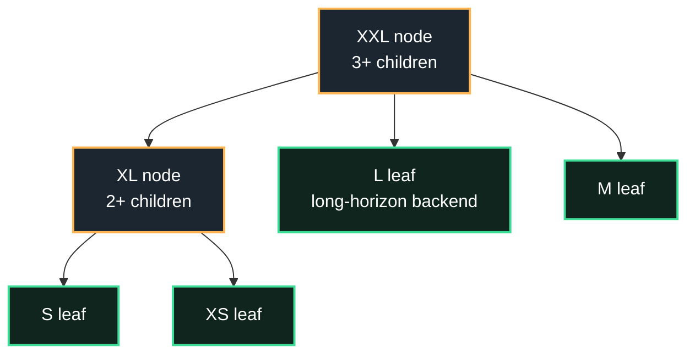
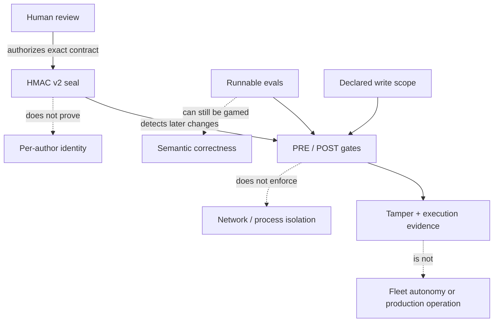

<div align="center">
  
  <h1>Task-Spec</h1>
  <p><strong>The canonical atomic unit of work for coding agents.</strong></p>
  <p>One human-reviewable contract. Any conformant harness. Independent proof of done.</p>
</div>

Task-Spec is an open, vendor-neutral format and offline-first engine for turning
intent into atomic work. Each `T-*.md` file combines a bounded write scope,
dependencies, executable bash evals, behavior-to-eval traceability, an
authorization seal, and a post-execution acceptance envelope.

It is deliberately smaller than an orchestration platform. Task-Spec does not
schedule a fleet, host models, store credentials, or make an agent's own claim
of success trustworthy. It makes one unit of work portable and independently
checkable.

[Getting started](docs/getting-started/index.md) ·
[Guides](docs/guides/index.md) ·
[Reference](docs/reference/index.md) ·
[Trust](docs/trust/index.md) ·
[Examples](docs/examples/)

## Install

Choose one door; all install the same v3.6 skill contract and CLI.

| Door | Command | Best for |
|---|---|---|
| Pinned copy | `curl -fsSL https://raw.githubusercontent.com/luanmorenommaciel/task-spec/main/install.sh \| bash` | Codex, Kimi, Claude Code, and Grok Build in a repository |
| npm/GitHub | `npm install -g github:luanmorenommaciel/task-spec#v3.6.0` then `taskspec-install` | A globally discoverable CLI plus project skills |
| Claude marketplace | `/plugin marketplace add luanmorenommaciel/task-spec` then `/plugin install task-spec@taskspec` | Claude Code plugin workflow |
| Checkout development | `bash install.sh --target /path/to/repo --symlink` | Editing Task-Spec itself without copy drift |

The copy installer is non-clobbering, installs equivalent skills at
`.agents/skills/task-spec`, `.claude/skills/task-spec`, and
`.grok/skills/task-spec`, puts a pinned CLI launcher on PATH, never touches
provider/model credentials, and ends with `INSTALL=OK`.

```bash
taskspec doctor
taskspec setup
```

Requirements: Bash 3.2+, Git, Python 3, and `shellcheck` for the PRE-gate.
OpenSSL, `shasum`, or `sha256sum` enables Tier-1 HMAC verification.

## The mental model

An ordinary checklist tells an agent what somebody hopes will happen. An atomic
Task-Spec also defines what may change, how success is executed, who authorized
that exact contract, and how a separate acceptance step decides whether the
result is real.



| Artifact | Answers |
|---|---|
| `TaskPlan/v1` | Which units are being proposed, why, and with what explicit edges? |
| Task-Spec v3 | What may this one unit do, and what executable result proves it? |
| HMAC v2 seal | Has the body or execution authority changed since sign-off? |
| `TaskHandoff/v1` | What exact leaf, workspace, backend, scope, budgets, and commands reach a harness? |
| Acceptance envelope | Did independent eval, blast-radius, and seal checks pass after execution? |

## Your first atomic task

```bash
# 1. Prepare the repository.
taskspec init
taskspec setup signing
taskspec doctor

# 2. Ask the installed skill:
# “Turn this outcome into a complete TaskPlan. Research only if needed.”

# 3. Review exactly what is declared. Preview never invents missing units.
taskspec plan --manifest tasks/.plans/add-search.yaml

# 4. Generate the approved files, then inspect both structure and proof.
taskspec batch --plan tasks/.plans/add-search.yaml
taskspec validate tasks/T-*.md
taskspec dod tasks/T-*.md

# 5. Authorize one runnable leaf.
taskspec gate --stamp tasks/T-…-first-leaf.md

# 6. Emit a credential-free handoff for the selected harness.
taskspec handoff tasks/T-…-first-leaf.md --backend codex --json

# 7. After execution, independently accept it.
taskspec accept --stamp --gold-sanity tasks/T-…-first-leaf.md
```

See the complete [first-task walkthrough](docs/getting-started/first-task.md) and
the checked-in [TaskPlan example](docs/examples/task-plan.yaml).

## Leaves and nodes

Everything remains a Task-Spec, but not everything is directly executable.



| Size | Kind | Write-surface guidance | Dispatch rule |
|---|---|---:|---|
| XS | Leaf | ≤1 path | Runnable |
| S | Leaf | ≤2 paths | Runnable |
| M | Leaf | ≤3 paths | Runnable |
| L | Leaf | ≤5 paths | Runnable only on `TASKSPEC_LONG_HORIZON_BACKENDS`; one coherent done-condition |
| XL | Node | No writes | At least 2 children; never delegated |
| XXL | Node | No writes | At least 3 children; never delegated |

The write surface is the unique union of `touches_paths` and `creates_paths`.
Budgets expose coarse decomposition; cross-task lint also reports dual creation,
write conflicts, cycles, dangling edges, and write-disjoint concurrency groups.

## CLI at a glance

| Stage | Commands | Mutation boundary |
|---|---|---|
| Prepare | `init`, `setup`, `setup signing`, `doctor` | Non-clobbering workspace/key setup |
| Compose | `plan`, `batch --plan`, `new`, `migrate` | Preview is read-only; generation is explicit |
| Prove before work | `validate`, `dod`, `gate --stamp` | Only the gate writes `signed_off*` |
| Transfer | `handoff --backend …`, `agent-context` | Read-only JSON contracts; never credentials |
| Execute | `run`, any conformant harness | Evals run relative to the task workspace |
| Prove after work | `accept --stamp`, `transition … done` | Only acceptance writes `accepted*`; done requires it |
| Operate | `ready`, `lint`, `rebuild-state`, `metrics`, `conformance` | Deterministic derived state and analysis |

Global `--json` wraps any command in `TaskSpecCLIResult/v1`; global `--dry-run`
prevents supported mutations and reports intent. `NO_COLOR` or
`TASKSPEC_COLOR=0` disables ANSI; `TASKSPEC_COLOR=1` forces it. Run
`taskspec agent-context` for the complete machine contract and exit codes.

## Optional research, bounded on purpose

Firecrawl, Tavily, and Exa are optional provider packs under
[`integrations/research/`](integrations/research/). Core does not install or call
them. A harness explicitly selects a provider and normalizes results into
`AuthoringEvidence/v1`: source URL/title/time/digest, bounded claims/excerpts,
usage when available, and named unavailable/rate-limit/auth/timeout/schema-drift
states.

Provider evidence may inform context, anti-patterns, or guardrails. It never
silently becomes an acceptance criterion. Current repository support is limited
to credential-free fake adapters; live provider support requires a retained
smoke gate before it can be advertised.

## Trust boundaries



| Claim | Honest boundary |
|---|---|
| HMAC v2 | Tamper-evident shared-key authorization; not non-repudiation or a security sandbox |
| Runnable evals | Deterministic evidence when well designed; stub/Goodhart resistance helps but cannot make a weak oracle wise |
| `TaskHandoff/v1` | Portable transfer contract; it does not execute a model or schedule workers |
| `accepted: true` | The configured post-gate passed locally; not proof of deployment, production health, or external receipts |
| Conformance L0-L2 | An adapter honors format/lifecycle behavior in the suite; not fleet reliability evidence |

Read [Trust and security](docs/trust/index.md) before using unsupervised Tier 1.

## Current verified status

<!-- release-status:start -->
| Surface | Repository evidence | Status |
|---|---|---|
| Engine | Bash 3.2 portability, schemas, compatibility, HMAC v1/v2, sizing, backlog, DoD, conformance | Pass — `make check` → `CHECK=READY` |
| Experience | Copy/symlink installs plus init → sign → plan → generate → gate → handoff → execute → accept | Pass; experience suite 26/26 |
| Package | `npm pack --dry-run` and local global npm install | Pass; GitHub install pending release tag |
| Research | Offline fake Firecrawl/Tavily/Exa adapters and named failure states | Pass; live providers not advertised |
| Converge consumption | Deterministic generated mirror plus per-file SHA-256 lock | Pass |
| Publication | Canonical source commit, v3.6.0 tag, and remote curl/npm doors | Unpublished worktree; publish actions not performed |
<!-- release-status:end -->

The canonical release evidence lives in [release/evidence.json](release/evidence.json).
`make check` is the single local/CI gate and ends with `CHECK=READY` only when
doctor, docs, every self-test, and conformance are green.

## Architecture boundary

Standalone Task-Spec owns the format, schemas, engine, CLI, skill, installer,
contracts, examples, and conformance suite. Converge remains the higher-level
methodology/runtime: intent shaping, tracker projection, execution loops,
receipts, Cockpit, and future management. Converge consumes a pinned generated
mirror; it does not evolve a second editable Task-Spec engine.

## Contributing

```bash
make check
```

Format changes are triple-locked: schema, conformance fixture, and changelog.
The core gate path stays compatible with macOS Bash 3.2. See
[AGENTS.md](AGENTS.md) and [CHANGELOG.md](CHANGELOG.md).
