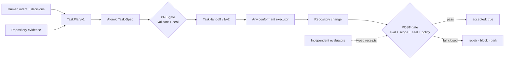
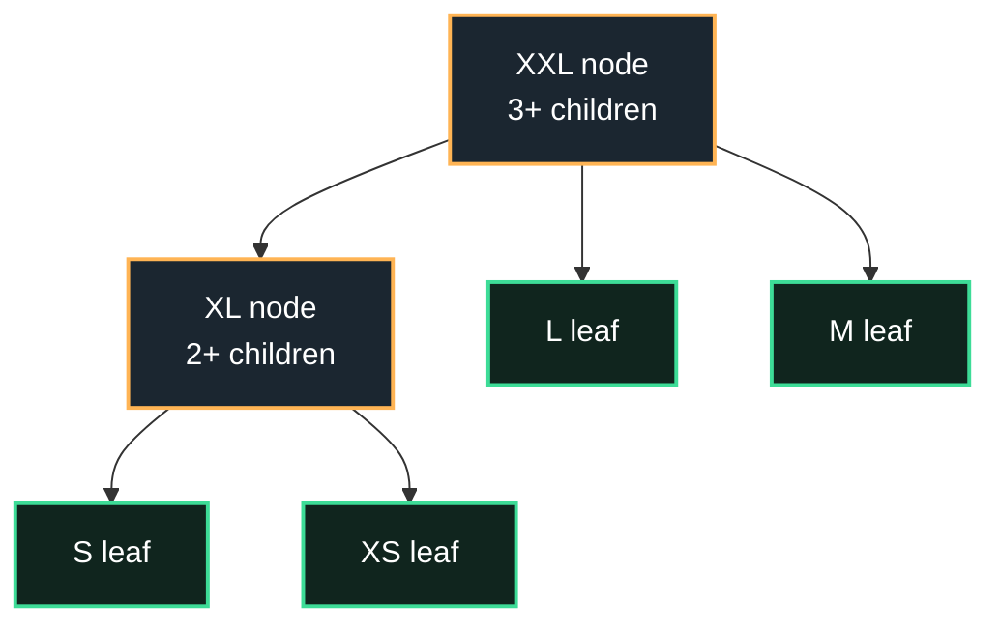

<div align="center">

[](https://github.com/luanmorenomaciel/task-spec)

<h1>Task-Spec</h1>

<p><strong>Agents can write code. Task-Spec makes them earn <code>done</code>.</strong></p>
<p>One open contract for bounded scope, executable proof, sealed authority,<br/>portable handoff, and independent acceptance.</p>

[](CHANGELOG.md)
[](spec/task-spec-v4.md)
[](#requirements)
[](#verified-status)
[](LICENSE)

Works with **Codex · Claude Code · Kimi · Grok Build · any conformant executor**

[Prove it](#prove-it-in-one-command) ·
[Highlights](#what-shipped-in-37) ·
[Features](#feature-matrix) ·
[Install](#installation) ·
[Use it](#step-by-step-usage) ·
[Architecture](#how-it-works) ·
[Trust](#trust-boundaries) ·
[Docs](#documentation)

</div>

---

## The missing contract between intent and execution

A prompt tells an agent what you want. A Task-Spec also records what the agent
may change, what observable behavior counts as success, what evidence must
exist, who authorized that exact contract, and what an independent gate must
verify afterward.

| Without Task-Spec | With Task-Spec |
|---|---|
| “Implement search and test it.” | One atomic leaf with explicit paths, behavior, evals, budget, and owner |
| The agent decides what “done” means while working | Humans review the contract; runnable evals decide the technical result |
| Scope changes disappear into the conversation | HMAC v2 breaks when authority-bearing fields change after sign-off |
| Every harness receives a different interpretation | Every harness receives the same credential-free handoff and task digest |
| “Tests pass” is the final claim | Acceptance reruns proof, checks the blast radius, verifies the seal, and binds required receipts |

Task-Spec deliberately stops at this boundary. It does not host models, schedule
a fleet, store credentials, create a sandbox, or turn a weak eval into a wise
oracle. It makes one unit of work portable, tamper-evident, and independently
checkable.

## Prove it in one command

After installation, run a complete lifecycle in a disposable repository:

```console
$ taskspec demo
Task-Spec isolated lifecycle
  PLAN=VALID
  DOD=COMPLETE
  VERDICT=DELEGATE TIER=1
  HANDOFF=TaskHandoff/v1
  EVAL=PASS
  ACCEPTED=1
DEMO=READY
```

`taskspec demo` creates an isolated Git repository, writes and validates a real
`TaskPlan/v1`, generates one atomic leaf, seals it, emits a portable handoff,
runs its eval, accepts the result, and removes the repository. It does not touch
the repository from which you invoke it.

That command is exercised by `make check`; tagged releases also have a separate
remote-install workflow that runs the curl and npm/GitHub distribution doors on
both Ubuntu and macOS before those doors are called verified.

## What shipped in 3.7

Version 3.7 keeps format v3 as the stable default and adds format v4 as an
explicit evidence-policy layer. The executor still receives a bounded task;
independent evaluators issue receipts that acceptance binds back to the exact
authorized task.

| Highlight | What it adds | Why it matters |
|---|---|---|
| **Evaluation policy** | deterministic, hidden holdout, graded, or human acceptance modes | Evidence requirements become part of the contract instead of harness folklore |
| **Hidden holdouts** | sealed evaluator bundles and redacted public descriptors | The executor can know what evidence is required without receiving the private oracle |
| **Typed receipts** | evaluation, environment, engine, graded, human, and authorization receipts | Evidence becomes machine-checkable and digest-bound |
| **Environment contracts** | local or portable runtime commitments plus observed receipts | “It passed on my machine” gets an explicit environment boundary |
| **Signer identity** | optional Ed25519 signing, verification, and revocation above HMAC | Teams can attribute evidence without pretending shared-key HMAC is identity |
| **Eval discrimination audit** | current change must pass; baseline and declared mutations must fail | An eval must distinguish the work from the unpatched state |
| **Author doctor** | flags vague goals, existence-only evals, open decisions, and unsafe scope | Weak authoring becomes visible before delegation |
| **Multi-engine evidence** | isolated, receipt-producing runs across nine declared model families | Missing engines are recorded as unavailable, never fabricated as passes |
| **A2A and MCP bridges** | digest-preserving envelopes plus a read-only MCP server | The atomic contract can cross modern agent protocols without changing meaning |
| **Installation proof** | self-verifying installer, isolated demo, and tagged-release smoke CI | A user can test the lifecycle before trusting it with real work |

The nine-family matrix is a harness, not a claim that nine real providers have
passed. Checked-in entries remain disabled until an operator supplies exact
models, adapters, credentials, and retained results.

## Five reasons to use Task-Spec

1. **Bound the work.** `touches_paths`, `creates_paths`, Do-Not-Touch, effort,
   dependencies, and budgets define the executor's authorized surface.
2. **Make proof executable.** Every behavior maps to at least one eval, every
   eval maps back to behavior, and the Exit Check is the terminal condition.
3. **Seal authority.** Only the PRE-gate writes `signed_off*`; changing the
   approved body or authority breaks the HMAC v2 seal.
4. **Change the player, not the contract.** Codex, Claude Code, Kimi, Grok, or a
   conformant custom executor receives the same handoff.
5. **Accept independently.** Only the POST-gate writes `accepted*`, after evals,
   scope, seal integrity, and any v4 evidence policy pass.

## Feature matrix

| Surface | Capability | Deterministic proof |
|---|---|---|
| Atomic authoring | v3/v4 scaffolds, approved `TaskPlan/v1`, batch generation | `taskspec plan`, `batch`, `validate` |
| Behavior contract | Given/When/Then IDs with bidirectional eval traceability | `taskspec dod` → `DOD=COMPLETE` |
| Scope control | bounded read/write surfaces and Do-Not-Touch rules | PRE-gate validation + POST-gate blast-radius check |
| Authorization | HMAC v2 over body, paths, dependencies, backend, agent, and budgets | `taskspec gate --stamp` → `TIER=1` |
| Portable handoff | credential-free `TaskHandoff/v1` for v3 and `v2` for v4 | `taskspec handoff --backend …` |
| Independent acceptance | eval rerun, scope audit, seal verification, receipt policy | `taskspec accept --stamp` → `ACCEPTED=1` |
| Eval quality | author warnings, baseline checks, mutation discrimination | `author-doctor`, `eval-audit`, `--gold-sanity` |
| Independent evidence | holdouts, typed receipts, environment and human evidence | `holdout`, `receipt`, v4 Gate F |
| Identity | optional Ed25519 evidence attribution and revocation | `taskspec identity verify` |
| Decomposition | XS/S/M/L leaves; XL/XXL composition nodes; dependency DAG | `taskspec lint`, `ready --all` |
| Multi-engine experiments | isolated worktrees, exact model IDs, retained run receipts | `taskspec evidence validate|plan|run` |
| Interoperability | A2A/MCP envelope round trips and read-only MCP tools | `taskspec bridge`, `taskspec mcp` |
| Agent ergonomics | one installed skill across four harness destinations | installer equivalence checks |
| Automation | JSON envelope, dry-run, stable tokens, shell completion | `--json`, `--dry-run`, `agent-context` |
| Portability | Bash 3.2 core, standard-library Python, offline by default | `make check`, conformance L0–L2 |

## Installation

### Source checkout — available now

This is the honest installation door while the `v3.7.0` release tag remains
unpublished:

```bash
git clone --depth 1 https://github.com/luanmorenommaciel/task-spec.git \
  "$HOME/.local/share/task-spec-src"
cd /path/to/your/repository
bash "$HOME/.local/share/task-spec-src/install.sh" --target "$PWD" --copy
export PATH="$HOME/.local/bin:$PATH"
taskspec doctor
taskspec demo
```

The installer ends with `INSTALL=OK` only after the installed engine reports the
expected version, all harness skill copies match the canonical skill, and the
CLI launcher resolves to that same engine.

### Pinned release doors — activate when `v3.7.0` is published

```bash
curl -fsSL \
  https://raw.githubusercontent.com/luanmorenommaciel/task-spec/v3.7.0/install.sh \
  | bash -s -- --target "$PWD"
```

```bash
npm install -g github:luanmorenommaciel/task-spec#v3.7.0
taskspec-install --target "$PWD"
```

### Claude marketplace

```text
/plugin marketplace add luanmorenommaciel/task-spec
/plugin install task-spec@taskspec
```

One installation gives each supported harness the same contract:

| Harness | Skill destination | Installed surface |
|---|---|---|
| **Codex** | `.agents/skills/task-spec/` | Task-Spec skill and CLI |
| **Kimi** | `.agents/skills/task-spec/` | Same skill and CLI |
| **Claude Code** | `.claude/skills/task-spec/` | Same skill, CLI, and compatibility agent |
| **Grok Build** | `.grok/skills/task-spec/` | Same skill and CLI |

### Installation guarantees

| Guarantee | Behavior |
|---|---|
| Non-clobbering | Existing unmanaged destinations are refused by default |
| Idempotent | Reinstalling the same managed version keeps valid destinations |
| Recoverable upgrade | `--force` backs up replaced managed paths with a UTC suffix |
| Pinned engine | Versions install side by side under `~/.local/share/task-spec/` |
| Harness parity | Installed skill content is compared with the canonical source |
| Credential safety | No model or provider credential is installed, copied, or requested |
| Verifiable | Engine and launcher version checks run before `INSTALL=OK` |
| Prove-before-use | `taskspec demo` exercises the complete lifecycle in isolation |

<details>
<summary><b>Installer controls and requirements</b></summary>

```text
--target DIR       repository receiving harness skills
--copy             pinned, non-clobbering copy installation (default)
--symlink          local checkout-development mode
--bin-dir DIR      CLI launcher directory (default: ~/.local/bin)
--no-bin           install skills only
--force            back up and replace managed destinations
```

### Requirements

- Bash 3.2+
- Git
- Python 3
- `shellcheck` for the PRE-gate and `taskspec demo`
- OpenSSL, `shasum`, or `sha256sum` for Tier-1 HMAC
- Node 18+ only for the npm installation door

</details>

## Step-by-step usage

Everything below happens inside the repository you want to change. The first
task should be XS or S and supervised; calibrate eval quality before increasing
autonomy.


### 1. Prepare the repository

```bash
taskspec init
taskspec setup signing
taskspec doctor
```

`init` creates only missing Task-Spec workspace files. The signing key lives in
the repository's private Git common directory and never enters a handoff.

### 2. Ask for a plan, not files

Use the installed skill from chat:

```text
Turn “add repository search” into atomic Task-Specs. Inspect the repository,
show me the TaskPlan first, and do not generate files until I approve it.
```

The expected boundary is a complete `TaskPlan/v1`: atomic units, dependencies,
write surfaces, behaviors, evals, budgets, and open questions. Approval of the
plan is separate from authorization to execute a leaf.

### 3. Preview, approve, and generate

```bash
taskspec plan --manifest tasks/.plans/add-search.yaml
taskspec batch --plan tasks/.plans/add-search.yaml
```

`plan` is read-only. `batch` refuses an unapproved, malformed, cyclic, or
credential-bearing manifest.

### 4. Inspect the contract and its proof graph

```bash
taskspec validate tasks/T-…-add-search.md
taskspec dod tasks/T-…-add-search.md
taskspec author-doctor tasks/T-…-add-search.md
```

Do not continue until structure is valid, `DOD=COMPLETE`, and every unresolved
semantic decision has an accountable owner or a blocked status.

### 5. Authorize exactly one ready leaf

```bash
taskspec gate --stamp tasks/T-…-add-search.md
taskspec handoff tasks/T-…-add-search.md --backend codex --json
```

The gate writes the HMAC seal. The handoff is read-only, digest-bound, and
credential-free. A v4 leaf includes public evidence and environment commitments
without revealing private holdout commands.

### 6. Execute with the chosen harness

Give the handoff to Codex, Claude Code, Kimi, Grok Build, or a conformant custom
executor. The player may change; the authorized paths, budgets, behaviors, and
eval commands do not.

### 7. Accept independently

```bash
taskspec run tasks/T-…-add-search.md
taskspec accept --stamp --gold-sanity tasks/T-…-add-search.md
taskspec transition T-…-add-search done
```

Acceptance reruns the Exit Check, rejects out-of-scope changes, verifies the
sign-off envelope, applies v4 receipt policy when present, and only then writes
`accepted: true`. A task cannot transition to `done` before acceptance.

### 8. Expose the next safe frontier

```bash
taskspec ready --all
taskspec lint
```

The backlog layer reports dependency-unblocked leaves, collisions, cycles,
dangling edges, and write-disjoint concurrency groups. Task-Spec does not choose
or schedule that frontier for you.

## Choose the evidence level

| Need | Use | Acceptance boundary |
|---|---|---|
| Normal repository change with strong runnable evals | **Format v3** (default) | evals + blast radius + HMAC integrity |
| Hidden evaluator or benchmark | **v4 · holdout** | sealed holdout receipt bound to task and handoff |
| Subjective quality with a rubric | **v4 · graded** | graded receipt from the declared evaluator |
| Accountable semantic approval | **v4 · human** | named human acceptance receipt |
| Portable environment claim | **v4 · environment contract** | observed environment receipt matches the commitment |

```bash
taskspec new add-search S codex
taskspec new --format 4 benchmark-search S codex
```

Use v4 because the evidence source must be independent—not because a task looks
important. Structural validity never replaces semantic human review.

## Inside one atomic task

One Task-Spec aligns four layers:

| Layer | Fields and sections | What it controls |
|---|---|---|
| **Bounded workspace** | `touches_paths`, `creates_paths`, Do-Not-Touch | Where the executor may write and what acceptance must reject |
| **Execution contract** | goal, context, dependencies, effort, backend, agent contract, budgets | What the unit means and how much autonomy it receives |
| **Executable proof** | behaviors, success criteria, runnable evals, Exit Check | What observable outcome counts as success |
| **Authorization envelope** | `signed_off*`, `hmac-sha256-v2` | Whether body and authority still match human sign-off |

The strongest invariant is bidirectional traceability: every `B-N` behavior is
verified by at least one eval, and every eval points back to at least one
behavior. Neither side may dangle.

## How it works




| Moment | Owner | Output | What is actually proven |
|---|---|---|---|
| Compose | author + human | plan and atomic specs | declared work, dependencies, and proof are explicit |
| PRE-gate | deterministic gate | sign-off seal and tier | the exact contract is structurally ready and tamper-evident |
| Handoff | dispatcher | v1/v2 JSON contract | each executor receives the same digest, scope, budget, and commands |
| Execution | selected harness | repository change | an authorized attempt occurred; success is not implied |
| Evidence | independent surfaces | typed receipts | named evaluators reported results bound to the task |
| POST-gate | acceptance gate | acceptance verdict | configured proof, scope, integrity, and policy passed or failed |

## Atomic leaves and composition nodes



| Size | Kind | Write-surface guidance | Dispatch rule |
|---|---|---:|---|
| XS | Leaf | ≤1 path | Runnable |
| S | Leaf | ≤2 paths | Runnable |
| M | Leaf | ≤3 paths | Runnable |
| L | Leaf | ≤5 paths | Long-horizon backend; one coherent done-condition |
| XL | Node | No writes | At least 2 children; never delegated |
| XXL | Node | No writes | At least 3 children; never delegated |

Nodes compose; leaves execute. If a leaf exceeds its coherent write surface or
done-condition, decompose it instead of hiding more autonomy inside the prompt.

## Trust boundaries

| Claim | Honest boundary |
|---|---|
| HMAC v2 | Tamper-evident shared-key authorization; not identity, non-repudiation, or isolation |
| Runnable evals | Deterministic evidence when well designed; no validator can make a weak oracle wise |
| `TaskHandoff/v1/v2` | Portable transfer contract; it does not invoke a model or schedule workers |
| v4 receipts | Bound reports from named evidence surfaces; not universal correctness |
| Ed25519 receipt | Optional signer attribution and revocation; not authorization policy by itself |
| `accepted: true` | The configured POST-gate passed; not proof of deployment or production health |
| Conformance L0–L2 | An adapter honors format and lifecycle behavior in the suite; not fleet reliability |
| Release smoke CI | Published curl and npm/GitHub doors install and pass the isolated demo; it does not test provider credentials |

Legacy HMAC v1 seals remain authentic on their original terms but are narrowed
to supervised Tier 2 until re-stamped with v2. Read
[Trust and security](docs/trust/index.md) before using unsupervised Tier 1.

## CLI map

| Stage | Commands | Mutation boundary |
|---|---|---|
| Prove the install | `doctor`, `demo`, `conformance --self-test` | demo/conformance use disposable fixtures only |
| Prepare | `init`, `setup`, `setup signing` | non-clobbering workspace and private key setup |
| Compose | `plan`, `batch --plan`, `new`, `migrate` | preview is read-only; generation is explicit |
| Prove before work | `validate`, `dod`, `author-doctor`, `gate --stamp` | only the gate writes `signed_off*` |
| Transfer | `handoff --backend …`, `agent-context` | read-only machine contracts; never credentials |
| Execute | `run`, any conformant harness | evals run relative to the task workspace |
| Prove after work | `accept --stamp`, `transition … done` | only acceptance writes `accepted*`; done requires it |
| Strengthen evidence | `holdout`, `receipt`, `eval-audit`, `identity` | explicit evidence paths; v4 fails closed when required proof is missing |
| Interoperate | `bridge`, `mcp`, `evidence` | read-only by default; matrix runs retain receipts |
| Operate | `ready`, `lint`, `rebuild-state`, `metrics` | deterministic derived state and backlog analysis |

Global `--json` wraps results in `TaskSpecCLIResult/v1`; global `--dry-run`
prevents supported mutations and reports intent. `NO_COLOR` or
`TASKSPEC_COLOR=0` disables ANSI. `taskspec agent-context` exposes the complete
machine-readable command and token contract.

## Verified status

<!-- release-status:start -->
| Surface | Repository evidence | Status |
|---|---|---|
| Engine | Bash 3.2 portability, schemas, compatibility, HMAC v1/v2, sizing, backlog, DoD, conformance | Pass — `make check` → `CHECK=READY` |
| v4 evidence | Policy validation, hidden holdout, receipt binding, mutation audit, identity/revocation, A2A/MCP round trip | Evidence suite 28/28_local |
| Experience | Copy/symlink installs, isolated demo, and init → sign → plan → generate → gate → handoff → execute → accept | Pass; experience suite 30/30 |
| Package | `npm pack --dry-run` and local global npm install | Pass; GitHub install pending release tag |
| Research | Offline fake Firecrawl/Tavily/Exa adapters and named failure states | Pass; live providers not advertised |
| Converge consumption | Deterministic generated mirror plus per-file SHA-256 lock | Not updated |
| External engines | Nine-family matrix contract and honest unavailable state | Not run; no real-engine result claimed |
| Publication | Canonical source commit, main branch, v3.7.0 tag, and remote curl/npm doors | Implemented locally; unpublished; tag-dependent installs pending v3.7.0 release tag |
<!-- release-status:end -->

The canonical status source is [release/evidence.json](release/evidence.json).
`make check` is the single local and normal-CI boundary. It ends with
`CHECK=READY` only when doctor, documentation lint, every self-test, the
isolated demo, and conformance are green.

Hosted status is reported separately from local evidence. A workflow that fails
before receiving a runner has not executed the repository gate and must not be
described as a test failure or a pass.

## Documentation

| Start here | Best for |
|---|---|
| [Getting Started](docs/getting-started/index.md) | installation, signing, and the first accepted task |
| [Guides](docs/guides/index.md) | repository scans, research evidence, multi-engine execution, and recovery |
| [Reference](docs/reference/index.md) | CLI, contracts, schemas, TaskPlan, TaskHandoff, and AuthoringEvidence |
| [Trust](docs/trust/index.md) | HMAC limits, eval gaming, supervision tiers, blast radius, and conformance |
| [Examples](docs/examples/) | leaves, composition nodes, evidence bundles, and portable handoffs |
| [Format v3](spec/task-spec-v3.md) | stable standalone Task-Spec contract |
| [Format v4](spec/task-spec-v4.md) | opt-in evidence, identity, and environment policy |
| [Conformance](spec/conformance/README.md) | what an adapter must prove at L0, L1, and L2 |
| [Changelog](CHANGELOG.md) | compatibility and engine history |

## FAQ

<details>
<summary><b>Does my coding agent need native Task-Spec support?</b></summary>

No. The installed skill is markdown plus scripts. Any harness that can discover
the skill and invoke shell commands can drive the lifecycle. The deterministic
CLI remains the referee.
</details>

<details>
<summary><b>Why sign a task instead of relying only on Git history?</b></summary>

Git records that bytes changed. HMAC v2 records that the exact body and fields
granting authority still match what a human reviewed at delegation time.
</details>

<details>
<summary><b>Does Task-Spec run many agents or schedule a fleet?</b></summary>

No. It defines, authorizes, hands off, and accepts one atomic leaf. `ready` can
expose a safe frontier and `lint` can find write-disjoint groups; orchestration
remains outside this contract.
</details>

<details>
<summary><b>Can I add it to an existing repository?</b></summary>

Yes. The installer and `taskspec init` are non-clobbering by default. Start with
one supervised XS or S task, inspect every artifact, and calibrate eval quality
before granting more autonomy.
</details>

<details>
<summary><b>Does accepted mean deployed?</b></summary>

No. It means the configured acceptance contract passed in the observed
environment. Deployment and production verification need their own tasks,
evidence, and owners.
</details>

## Provenance

Task-Spec was extracted from Converge and owns the canonical format, schemas,
engine, CLI, skill, installer, examples, and conformance suite. The immutable
donor baseline is `converge@f78f077`; the portable mapping is recorded in
[the donor map](docs/reference/converge-donor-map.md). Converge remains the
higher-level methodology and runtime for intent shaping, coordination, loops,
receipts, and future management.

## Contributing

```bash
make check
```

Format changes are triple-locked: schema, conformance fixture, and changelog.
The core gate path stays compatible with macOS Bash 3.2. See
[AGENTS.md](AGENTS.md) for repository conventions.

## License

[MIT](LICENSE) — one open contract, any conformant executor.
