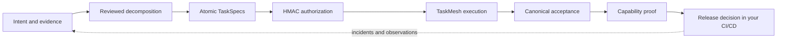
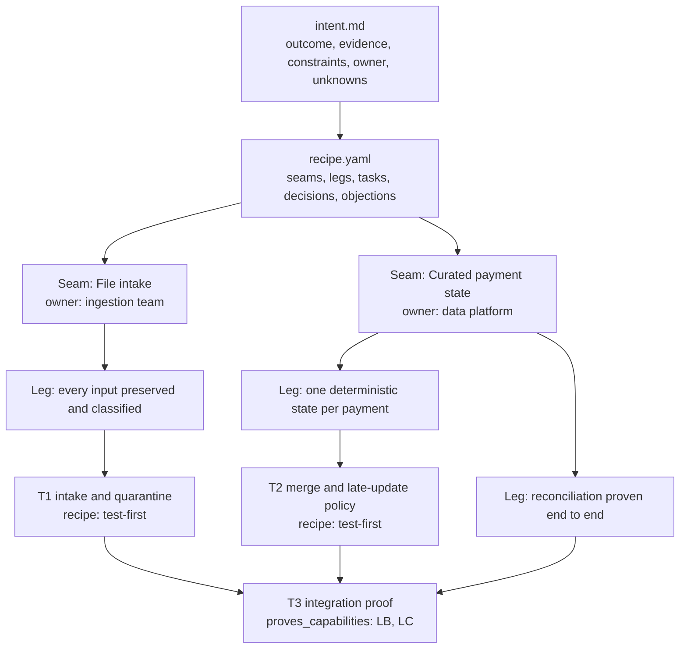
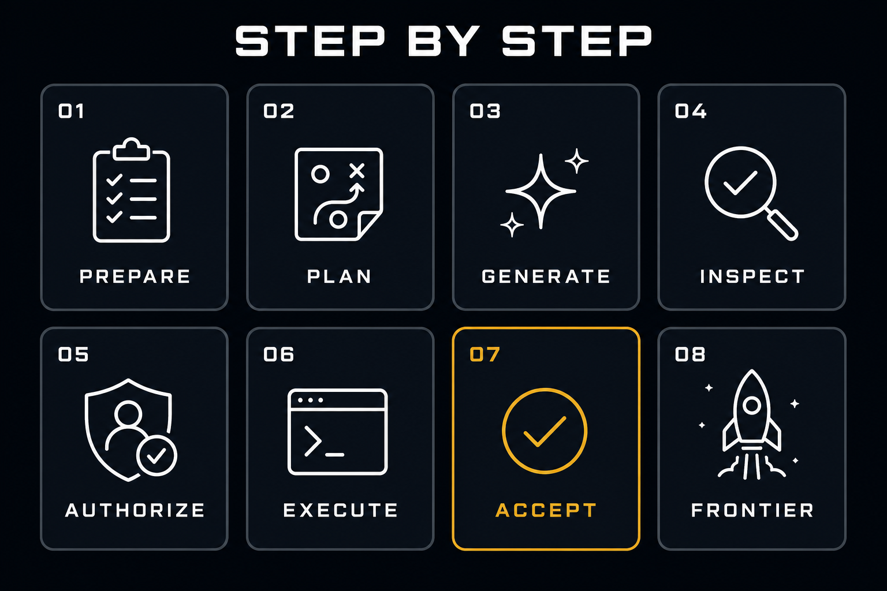
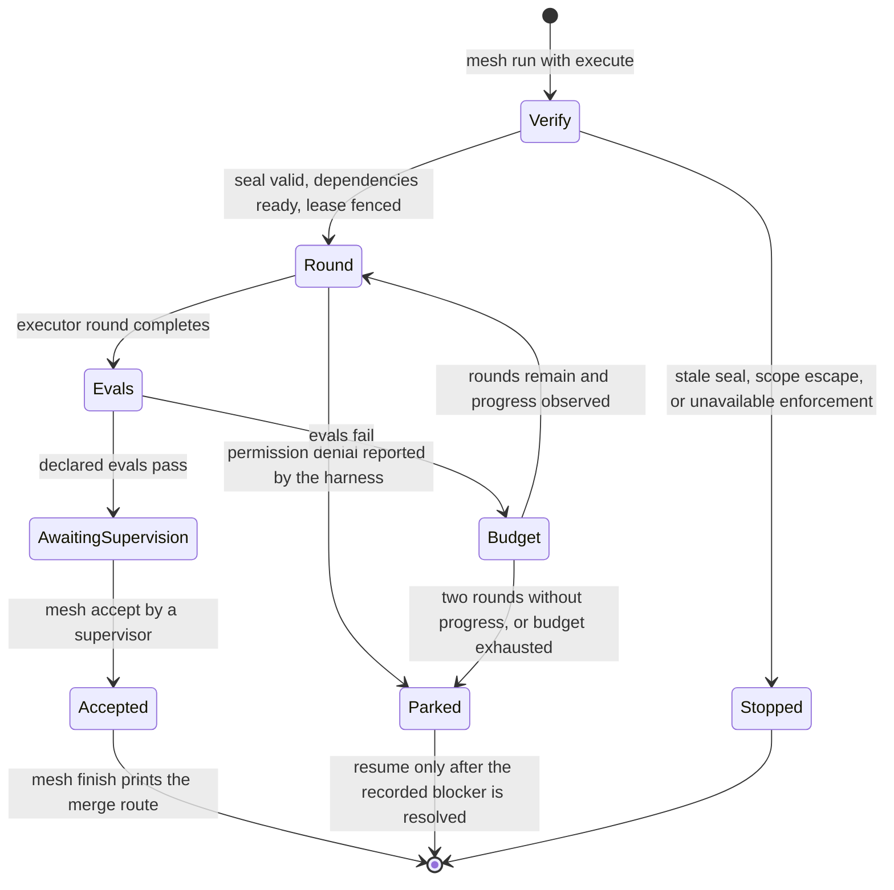
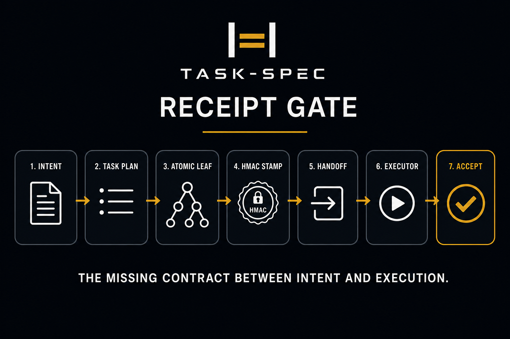
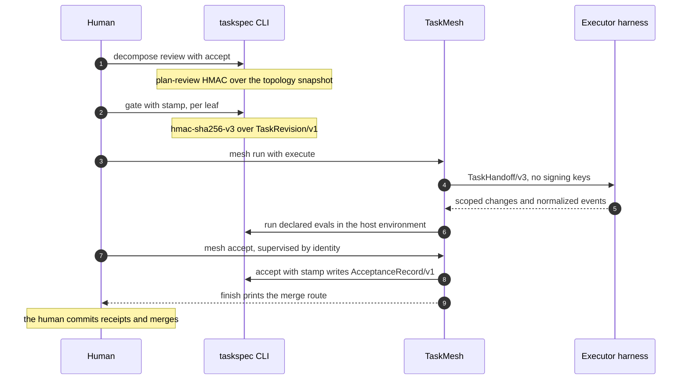

<div align="center">


# TaskSpec

**From engineering intent to accepted work.**

Native decomposition, HMAC-sealed atomic contracts, bounded execution recipes,<br/>
and verifiable acceptance across Codex, Claude Code, Grok Build, Kimi, Cursor, and OMP.

[](CHANGELOG.md)
[](https://github.com/luanmorenommaciel/task-spec/releases/latest)
[](https://github.com/luanmorenommaciel/task-spec/actions/workflows/ci.yml)
[](LICENSE)

[Why](#why-taskspec) · [At a glance](#at-a-glance) · [How it works](#how-it-works) ·
[Quick start](#quick-start) · [Chat](#chat-experience) · [Workflow](#workflow) ·
[TaskMesh](#taskmesh-execution) · [Trust](#trust-boundaries) · [Repository](#repository-map) · [Docs](#documentation)

</div>

## Why TaskSpec

Coding agents are good at writing code and bad at knowing when they are done,
what they were allowed to touch, and who said yes. A chat transcript is not a
contract. A green test run is not an authorization. A merged branch is not proof
that the capability you asked for exists.

TaskSpec gives every unit of engineering work a durable contract: the outcome,
the writable paths, the evidence that counts as done, the execution budget, and a
cryptographic seal bound to that exact revision. TaskMesh executes sealed work in
bounded rounds and records what happened. Your coding harness still writes the
code. TaskSpec proves the result and keeps the human decisions separate.

| What you get | How TaskSpec delivers it |
|---|---|
| One outcome per task, small enough to accept or reject | Atomic TaskSpecs sized XS to L, with behavior-to-eval traceability |
| Plans you can review before anything is authorized | Native decomposition into seams, swimlanes, capability legs, and leaves; review is signed |
| Authority that cannot drift | `hmac-sha256-v3` seal over the exact task revision; a changed byte is a new revision |
| Execution that stops instead of wandering | Recipes with round budgets, no-progress breakers, scope checks, and permission-denial parking |
| Proof, not status labels | Canonical acceptance records, capability proof gaps, and imported operational evidence |
| Freedom to pick the harness | Same contract for Codex, Claude Code, Grok Build, Kimi, Cursor, and attested OMP sandboxes |

TaskSpec is not a coding agent, a hosted service, or a merge bot. It never merges
or pushes your branch, it never widens the scope of a sealed task, and it does not
claim semantic truth about your product. It records who authorized what, what ran,
and what evidence exists.

## At a glance

Measured on the 3.10.0 candidate source on `main`.

| Measure | Value | Source |
|---|---|---|
| CLI commands | 43 top-level, 76 including subcommands | `src/cli/commands.json`, [CLI reference](docs/reference/cli.md) |
| Machine contracts | 58 JSON Schemas | [`spec/schemas/`](spec/README.md) |
| Conformance fixtures | 8 task fixtures and 2 toolkit fixtures | [`spec/conformance/`](spec/conformance/README.md) |
| Test scripts | 53 shell, 2 Python | [`tests/`](tests/README.md) |
| Execution strategies | 5 pinned recipes | `taskspec recipe list` |
| TaskMesh adapters | 4: Codex, Claude Code, Grok Build, OMP | [`harness/mesh-adapters/`](harness/README.md) |
| Chat harnesses | 5, through 4 skill directories | [Skills pack](skills/README.md) |
| Task formats | v1 to v4 readable; v3 is the authoring default | [Format v3](spec/task-spec-v3.md), [opt-in v4](spec/task-spec-v4.md) |
| Documentation pages | 73 | [`docs/`](docs/index.md) |
| Retained quality score | 97/100 for the 3.8.1 corridor | [Release evidence](release/README.md) |

**Current status.** `main` holds the **3.10.0 integrated-toolkit candidate**. The
latest published release is **v3.9.0**. Native decomposition and recipes are opt-in
while harness qualification and the comparative pilot are incomplete. A passing CI
run is evidence for its source revision, not a release or a production claim. See
the [release process](docs/maintainers/release-process.md).

**Availability.** This repository is private. Every install command below needs an
account with access and an authenticated `gh` or `git` client. Distribution today:

| Channel | State |
|---|---|
| GitHub release | Latest is `v3.9.0`, with source archive, checksums, SPDX SBOM, signed provenance, and `taskspec-meshd` helpers for macOS and Linux on amd64 and arm64 |
| GitHub pre-release | `v3.10.0-rc.1` carries this candidate's archive and helpers for review. It is not a qualified release |
| Source install | `install.sh` from a clone, the only way to get the 3.10.0 candidate toolkit |
| Package registries | Not published to npm or GitHub Packages yet. `package.json` targets `@luanmorenommaciel/task-spec`; installs go through `git+https://` today |
| Claude plugin marketplace | Manifests are version-matched in [`.claude-plugin/`](.claude-plugin/plugin.json); listing follows publication |

## How it works



| Stage | Who decides | Durable artifact | Command surface |
|---|---|---|---|
| Intent | You, with the chat skill | `intent.md`, evidence digests, open decisions | `decompose init`, `example intent` |
| Decomposition | Human reviewer | Signed plan review, TaskPlan, `TaskPlanLineage/v1` | `decompose prepare`, `review`, `compile` |
| Atomic contract | Human authorizer | `hmac-sha256-v3` seal over `TaskRevision/v1` | `validate`, `dod`, `author-doctor`, `gate --stamp` |
| Execution | TaskMesh, inside the signed budget | Attempts, leases, round evidence, worktrees | `mesh run`, `mesh status`, `mesh resume` |
| Acceptance | Supervisor | `AcceptanceRecord/v1` and receipts | `mesh accept`, `accept --stamp` |
| Proof and release | You, in your existing CI/CD | Capability proof gaps, imported operational receipts | `status --initiative`, `graph --view capabilities` |

Small work can start directly with one atomic task. Design, testing, and deployment
attach to the work they concern; they never become mandatory swimlanes.

## Quick start

### Install the 3.10.0 candidate

Requires Python 3.11+ and Go 1.25+ for the source-built Mesh helper.

```bash
git clone https://github.com/luanmorenommaciel/task-spec.git \
  "$HOME/.local/share/task-spec-src"
bash "$HOME/.local/share/task-spec-src/install.sh" --global --copy --toolkit
export PATH="$HOME/.local/bin:$PATH"
taskspec doctor
taskspec mesh doctor
taskspec recipe list
taskspec guide decomposition
```

`--toolkit` installs the CLI, a version-matched Mesh helper, the chat skill for
every harness, installed guides, and a private Python runtime with locked
dependencies. Omit `--toolkit` for a core-only install. Use
`--target /path/to/project --copy` for a project-local install. Existing
unmanaged destinations are refused by default.

### Prove the lifecycle in one command

```console
$ taskspec demo
Task-Spec isolated lifecycle
  PLAN=VALID
  DOD=COMPLETE
  VERDICT=DELEGATE TIER=1
  HANDOFF=TaskHandoff/v3
  EVAL=PASS
  ACCEPTED=1
DEMO=READY
```

The demo creates and removes a disposable repository. It exercises planning,
sealing, handoff, evals, and acceptance without touching your project. Every
command shown in this README is indexed to the test that executes it in
[README command coverage](docs/readme-command-coverage.json).

<details>
<summary><strong>Published release v3.9.0</strong> (no native decomposition or recipes)</summary>

```bash
release_dir="$(mktemp -d)"
gh release download v3.9.0 --repo luanmorenommaciel/task-spec \
  --pattern 'task-spec-3.9.0.tar.gz*' --pattern 'taskspec-meshd-*' \
  --dir "$release_dir"
(cd "$release_dir" && shasum -a 256 -c task-spec-3.9.0.tar.gz.sha256)
tar -xzf "$release_dir/task-spec-3.9.0.tar.gz" -C "$release_dir"
bash "$release_dir/task-spec-3.9.0/install.sh" --global --copy --with-mesh
```

npm, Claude marketplace, and per-harness options are in the
[installation reference](docs/getting-started/installation.md).

</details>

<details>
<summary><strong>Requirements by feature</strong></summary>

| Feature | Needs |
|---|---|
| Core authoring, gate, accept | Bash 3.2+, Git, Python 3, `shellcheck`; OpenSSL, `shasum`, or `sha256sum` for HMAC |
| Native decomposition | Python 3.11+ in the provisioned private runtime |
| TaskMesh from source | Go 1.25+; supervised execution also needs the selected harness CLI |
| Attested autonomous OMP | Pinned container runtime, provider configuration, external attestor. See [execution](docs/guides/toolkit/execution.md) |

</details>

## Chat experience

Install once and the `task-spec` skill is available inside your coding harness.
The skill reads current CLI state before it acts, so plans, attempts, and
acceptance records carry context across sessions and across harnesses.

| Harness | User-level skill | Project-local skill |
|---|---|---|
| Codex, Kimi | `~/.agents/skills/task-spec/` | `.agents/skills/task-spec/` |
| Claude Code | `~/.claude/skills/task-spec/` | `.claude/skills/task-spec/` |
| Grok Build | `~/.grok/skills/task-spec/` | `.grok/skills/task-spec/` |
| Cursor | `~/.cursor/skills/task-spec/` | `.cursor/skills/task-spec/` |

Start with an outcome, not a task list:

> Use task-spec. Inspect this repository and plan reliable payment ingestion:
> handle duplicates and late updates, quarantine malformed records, and prove
> reconciliation. Show unresolved decisions and proposed atomic tasks.
> Deployment is outside this request.

Then talk normally as the work progresses:

| You say | The skill does |
|---|---|
| "Why are these tasks separate?" | Explains seams, dependencies, and independently assessable completion |
| "What needs my decision?" | Lists missing product decisions and pending authorizations |
| "Run the authorized work." | Verifies seals and dispatches the eligible wave through TaskMesh |
| "Why did execution stop?" | Reads the actual attempt, evidence, deadline, and remaining rounds |
| "Continue this initiative." | Reconstructs persisted state and reuses recorded decisions |
| "What is accepted and what remains unproven?" | Reads canonical acceptance and capability proof gaps |

Replies follow one shape: **outcome, current state, evidence or blocker, next
action**. Plan approval, task authorization, supervisor acceptance, and deployment
stay separate human decisions. Routine repair inside an authorized recipe does not
need a new decision. A denied tool action stops at the reported boundary.

The [data-engineering walkthrough](docs/guides/toolkit/chat.md) shows a full
conversation with the internal commands and artifacts behind each reply. Skill
installation is supported for every harness above; behavioral qualification per
harness is tracked separately in [release evidence](release/README.md). Root
[SKILL.md](SKILL.md) and its [pack mirror](skills/task-spec/SKILL.md) are
byte-for-byte identical.

## Workflow

Two paths share one contract. Use the initiative path when the outcome spans
several owners or capabilities. Use direct authoring when one small change is
already understood.

### Initiative path

The decomposition recipe is the central authored file. Each seam owns one
swimlane. Each leg names an observable state and its proof. Each leaf owns
bounded writes and discriminating evals.



Run these inside your project. Replace IDs, paths, and reviewer identities with
the real reviewed work; these are checkpoints, not an unattended script.

**1. Capture intent.**

```bash
taskspec init
taskspec setup signing
taskspec doctor
taskspec agent-context
taskspec example intent --out intent.md
taskspec decompose init payments --intent-file intent.md
```

Edit `intent.md`, then research the repository and author `recipe.yaml`. Local
evidence needs exact digests. Missing ownership or an unresolved product decision
is a blocker to record, not a gap to fill with a guess.

**2. Prepare, review, materialize.**

```bash
taskspec decompose prepare payments --recipe recipe.yaml
taskspec decompose status payments
taskspec decompose review payments --accept --reviewer <identity> --reason <decision>
taskspec decompose compile payments
taskspec plan --manifest tasks/.plans/payments/task-plan.json
taskspec batch --plan tasks/.plans/payments/task-plan.json
```

`prepare` validates and projects the topology; it never approves. `review`
signs the snapshot with the repository key. `compile` emits the TaskPlan and
lineage. `batch` writes unsealed leaves under `tasks/`. A blocked proposal with
`OPEN` objections is a valid outcome. See [decomposition](docs/guides/toolkit/decomposition.md).

**3. Inspect and seal exact revisions.**

```bash
taskspec validate tasks/T-...-payments.md
taskspec dod tasks/T-...-payments.md
taskspec author-doctor tasks/T-...-payments.md
taskspec recipe show test-first
taskspec gate --stamp tasks/T-...-payments.md
```

Check outcome, writable paths, dependencies, eval quality, and budget before
sealing. The gate runs the evals to prove they execute; failing evals on unbuilt
work are expected. Commit the plan bundle and leaves first, because TaskMesh
creates worktrees from the committed revision. See [recipes](docs/guides/toolkit/recipes.md).

**4. Execute, accept, and prove.**

```bash
taskspec mesh init
taskspec status --initiative payments
taskspec graph --initiative payments --view capabilities
taskspec mesh frontier
taskspec mesh run --initiative payments --execute
```

A run starts the currently eligible wave. Passing supervised evals wait for a
supervisor. `status --initiative` reports accepted tasks and unproven
capabilities separately. See [execution](docs/guides/toolkit/execution.md) and
[acceptance](docs/guides/toolkit/acceptance.md).

### Direct atomic authoring



For a small, understood change, scaffold one task, author its outcome and evals,
inspect it, and seal it:

```bash
taskspec new add-search S codex
```

Ordinary tasks without a managed recipe can use the direct handoff path:

```bash
taskspec handoff tasks/T-...-add-search.md --backend codex \
  --out .taskspec/handoffs/add-search.json
```

Give the handoff to the executor. After implementation, verify and accept the
actual result:

```bash
taskspec run tasks/T-...-add-search.md
taskspec accept --stamp --gold-sanity \
  --handoff .taskspec/handoffs/add-search.json tasks/T-...-add-search.md
taskspec transition T-...-add-search done
taskspec ready --all
taskspec graph --check
taskspec status T-...-add-search
```

`run` executes evals. `accept` verifies acceptance and writes the record.
Managed recipes always go through TaskMesh, even for a graph of one task.
See [first accepted task](docs/getting-started/first-task.md).

## TaskMesh execution

TaskMesh is the optional, repository-local control plane. It owns scheduling,
leases with fencing tokens, worktrees, attempt records, bounded repair, and
recovery. It runs only leaves that already carry a valid seal, and it cannot
widen their scope.



**Recipes** resolve a versioned strategy into the task before it is sealed, so a
later library update cannot change authorized work.

| Strategy | Use when | Internal steps |
|---|---|---|
| `direct` | The change is understood and small | Read context, implement, run evals |
| `test-first` | Behavior must be pinned before code | Write a discriminating check, implement, run checks and regressions |
| `plan-execute-verify` | Several files or a non-obvious order | Record a concise plan, execute, verify against the plan |
| `diagnose-repair-verify` | A failure or incident | Reproduce and gather evidence, repair the evidenced cause, re-verify |
| `research-synthesize-verify` | The answer depends on sources | Inspect authoritative sources, synthesize with revisions, verify claims |

New managed recipes default to three rounds and a two-round no-progress breaker,
capped by the signed budget and deadline. `mesh resume` never refunds rounds or
restarts the deadline; exhaustion needs reviewed successor work.

**Adapters** receive one `TaskHandoff/v3`, report their exact version, preserve
revision and scope identity, and never receive signing keys.

| Adapter | Harness | Mode |
|---|---|---|
| `codex-native` | Codex CLI | Supervised |
| `claude-native` | Claude Code | Supervised; restricted tools and empty MCP config unless declared |
| `grok-native` | Grok Build | Supervised |
| `omp-rpc` | OMP | Supervised, or attested autonomous in a pinned non-root sandbox with per-round signed evidence |

Rules that matter on first use:

- `mesh run` without `--execute` still creates a run, worktree, and lease. Use `--dry-run` for a preview.
- Supervised execution is the default. Required enforcement that is unavailable refuses; nothing downgrades silently.
- A reported permission denial parks the attempt. It is not an eval failure and never enters another repair round.
- `mesh finish` prints the human integration route. It does not merge or push your branch.

See [execution and recovery](docs/guides/toolkit/execution.md),
[TaskMesh contracts](docs/reference/taskmesh-contracts.md), and
[trust boundaries](docs/trust/taskmesh-boundaries.md).

## Trust boundaries



Four human decisions, four separate signatures or records. No worker can produce
any of them for itself.



| Evidence | What it establishes | What it does not establish |
|---|---|---|
| Plan review | Approval bound to the reviewed topology | Permission to execute any leaf |
| HMAC seal | Shared-key authorization and integrity of one exact task revision | Author identity, isolation, or semantic truth |
| Passing evals | The configured checks passed in their evaluated environment | A complete or correct oracle |
| Canonical acceptance | Required task proof and authority checks passed | Deployment or production health |
| Capability proof | Explicit composition obligations have evidence | Completion inferred from child status labels |
| Imported operational receipt | A reported result tied to its source and artifacts | Independent verification of target health |
| Hosted CI | The named checks passed on the named revision and platforms | Provider quality or release publication |

The [threat model](docs/trust/threat-model.md) lists what the seal defends
against and what it deliberately leaves to your environment.

## Repository map

| Surface | Where to look |
|---|---|
| Normative contract | [`spec/`](spec/README.md): formats, schemas, conformance, and the triple-lock rule for changing them |
| CLI and engine | `bin/taskspec`, `src/`: authoring, decomposition, recipes, gates, acceptance |
| Execution | `src/meshctl/` Python cockpit; `mesh/` Go control plane |
| Chat and adapters | [SKILL.md](SKILL.md), [`skills/`](skills/README.md), [`harness/`](harness/README.md) |
| Learning and reference | [`docs/`](docs/index.md): getting started, guides, concepts, reference |
| Validation | [`tests/`](tests/README.md), `spec/conformance/`, `.github/workflows/` |
| Distribution and evidence | `install.sh`, `tools/`, [`release/`](release/README.md) |
| The engine's own work | [`tasks/`](tasks/README.md), `.taskspec/`: dogfooded backlog and acceptance records |

The [ownership map](docs/maintainers/repository-map.md) explains change
boundaries. Frozen release evidence and accepted task history keep their original
paths. New how-tos belong in `docs/guides/`; canonical rules stay in `spec/`.

## Documentation

| Goal | Read |
|---|---|
| Understand the complete experience | [Toolkit journey](docs/guides/toolkit/index.md), [chat walkthrough](docs/guides/toolkit/chat.md) |
| Get a first accepted task | [Install](docs/guides/toolkit/install.md), [first task](docs/getting-started/first-task.md), [quick reference](docs/quick-reference.md) |
| Turn intent into contracts | [Intent](docs/guides/toolkit/intent.md), [decomposition](docs/guides/toolkit/decomposition.md), [recipes](docs/guides/toolkit/recipes.md) |
| Execute and recover | [Execution](docs/guides/toolkit/execution.md), [TaskMesh overview](docs/getting-started/taskmesh.md), [replanning](docs/guides/replanning-and-recovery.md) |
| Prove completion and operate | [Acceptance](docs/guides/toolkit/acceptance.md), [release and maintenance](docs/guides/toolkit/sdlc.md) |
| Migrate existing plans | [Seamwise import and rollback](docs/guides/toolkit/migration.md) |
| Evaluate the claims | [Five-minute reviewer route](docs/getting-started/reviewer-route.md), [release evidence](release/README.md) |
| Inspect the contract | [CLI reference](docs/reference/cli.md), [format v3](spec/task-spec-v3.md), [opt-in v4](spec/task-spec-v4.md), [conformance levels](docs/concepts/conformance-levels.md) |
| Understand the method | [Eval-driven development](docs/concepts/eval-driven-development.md), [decomposition concepts](docs/concepts/decomposition.md) |

This README follows patterns observed in the GitHub CLI, uv, and ripgrep READMEs:
direct navigation, an executable first result, and explicit limits. The
[grounding record](docs/maintainers/readme-grounding.json) keeps the sources.

## Contributing

Start with [CONTRIBUTING.md](CONTRIBUTING.md), [OPERATING.md](OPERATING.md), and
[AGENTS.md](AGENTS.md). Run the same release gate as hosted CI:

```bash
make check
```

Format changes update schemas, conformance fixtures, and the changelog together.
Skill changes preserve root and mirror parity and installed resources. README
changes must keep every command indexed to an executing test. Publication follows
the [release process](docs/maintainers/release-process.md).

### Contributors

Maintained by Luan Moreno Medeiros Maciel.

TaskSpec is built and dogfooded with coding agents working under its own contract.
The backlog in [`tasks/`](tasks/README.md) records which agent executed each accepted
leaf, and [`release/`](release/README.md) retains the evidence, including the runs
that failed review.

| Agent | Role in this repository |
|---|---|
| Claude Code | Authoring, execution through the `claude-native` adapter, and chat-behavior qualification |
| Codex | Authoring, execution through the `codex-native` adapter, and release supervision |
| Kimi | Dispatch harness target; see [`harness/engines/kimi.md`](harness/engines/kimi.md) |

Agent work meets the same boundary as human work. No worker seals its own task, no
worker accepts its own result, and no agent merges the user branch. See
[CONTRIBUTING.md](CONTRIBUTING.md) for the full rule set.

[MIT licensed](LICENSE). Report vulnerabilities through [SECURITY.md](SECURITY.md).

## Retained release evidence

This generated scorecard describes the **historical 3.8.1 release corridor**. It
is preserved as evidence, not a readiness score for the 3.10.0 candidate. The
[release catalog](release/README.md) separates the versioned corridors.

<!-- release-status:start -->
| Surface | Repository evidence | Status |
|---|---|---|
| Evidence-derived score | Only digest-matching retained artifacts earn points | **97/100**; target 97; release gate passed |
| Contract and trust | Revision-bound authorization, compatibility, and the explicit HMAC boundary | 24/25 |
| Lifecycle and recovery | Nested workspaces, graph recovery, atomic acceptance, and replay resistance | 25/25 |
| Documentation and DX | Installed reviewer route, executable docs, and generated status | 20/20 |
| Harness and packaging | All installation doors plus frozen Codex and Claude execution | 10/10 |
| Standards interoperability | Pinned official A2A and MCP SDK conformance | 9/10 |
| Private distribution and external proof | Hosted CI, private signed provenance, authenticated installs, and externally signed sandbox evidence | 9/10 |
| Publication | Task-Spec 3.8.1 at `351c39908ca0` | Published |
| Deliberately unclaimed | Semantic truth, ecosystem-wide certification, and long-running production reliability | 3 points remain unavailable by design |
<!-- release-status:end -->
