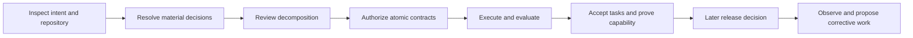
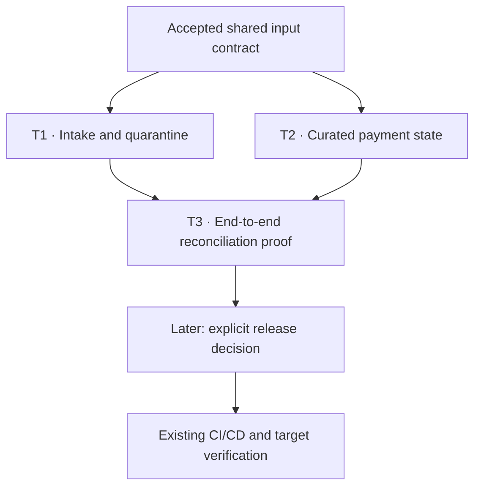

# From a chat request to accepted engineering work

Use the `task-spec` skill in your existing coding harness. The skill reads current
CLI state, explains the next action, and operates the existing TaskSpec and
TaskMesh interfaces. Plans, authorized contracts, attempts, and acceptance records
retain the state across sessions. Conversation history adds context.

This is an illustrative data-engineering journey mapped to current contracts.
It is not evidence that this pipeline ran or that every harness has passed full
behavioral qualification. Install the source toolkit using the [installation
guide](install.md); the published 3.9.0 release predates native decomposition.

## The engineer's starting request

> Use task-spec. Hourly payment files arrive in object storage. Build a reliable
> curated payments table, handle duplicates and late updates, quarantine malformed
> input, and prove reconciliation. Implement and test it first; deployment comes later.

Assume the repository already documents the input schema, owners, and test runtime.
The agent must verify those assumptions. It should ask only for missing material
decisions and applicable authorization, reusing decisions recorded for this revision.

These phases explain the journey. They are not additional persisted task states
or a second execution loop.

## 1. Inspect before asking

**Chat:** “I found the schema, ingestion code, and test runtime. The missing
product decision is the lateness window and what happens beyond it.”

**Illustrative decision:** accept updates whose first arrival is within 48 hours
of the source update timestamp; quarantine older updates for review.

**Internals:** inspect repository instructions, `taskspec agent-context`, existing
initiative state, code, tests, and evidence. Use `decompose init` for a new
initiative and author its recipe. Preserve missing evidence or ownership as blockers.

**Saved:** intent, source references, timestamp semantics, and the decision in
`tasks/.plans/<initiative-id>/`. Persist first-arrival metadata so replay does not
silently change eligibility. The 48-hour rule is an example product decision,
not a TaskSpec default.

## 2. Explain why work is separate

**Chat:** “File intake owns valid input and quarantine. Curated payment state
owns deterministic updates and replay behavior. An integration task proves the
combined result.”

| Swimlane / seam | Capability leg | Candidate atomic work |
|---|---|---|
| File intake | Every input is preserved and classified | T1: ingestion, validation, quarantine, and its tests |
| Curated payment state | One deterministic current state per payment | T2: merge, deduplication, late-update policy, and its tests |
| Curated payment state | End-to-end reconciliation is proven | T3: integration fixtures and reconciliation proof |

T1 and T2 can run together only when their actual dependencies, writable paths,
and shared resources permit it. A shared mutable test database can require
serialization. T3 is ordinary authorized work attached to a capability; it does
not create a mandatory testing swimlane. Oversized leaves must be split further.

**Internals:** `decompose prepare` validates the authored proposal. Human review
binds the topology snapshot through `decompose review`; `decompose compile`
emits the TaskPlan and lineage. `plan` previews; `batch` materializes unsealed leaves.

**Decision:** approve the concrete topology. This does not authorize execution.
See [decomposition and review](decomposition.md).

## 3. Review and authorize the exact atomic contracts

**Chat:** “The curated-state task owns merge logic and its tests. Its resolved
`test-first` recipe includes duplicate handling, ordering, replay stability, and
the 48-hour boundary. Review its writable paths, proof, and budget before sealing.”

Each task retains one outcome, bounded writes, applicable constraints, dependencies,
evidence, proof obligations, and an immutable parent snapshot reference. Strategy
instructions are resolved before the HMAC seal; installed library changes cannot
modify an authorized recipe.

**Internals:** `validate`, `dod`, and `author-doctor` inspect authoring quality;
`gate --stamp` authorizes the exact ready revision with applicable human authority.
Workers cannot seal themselves. Keep authorized tasks and their native provenance
in the Git revision from which Mesh creates worktrees.

**Decision:** authorize concrete task contracts. Git recording does not replace
review or sealing. See [atomic recipes](recipes.md).

## 4. Run the authorized work

**Engineer:** “Run the authorized work.”

**Illustrative update:** “T1 awaits acceptance. T2's replay check failed and it
is repairing within its authorized scope. T3 is waiting for its dependencies.”

**Internals:** initialize Mesh in the authorized host environment, inspect the
frontier, and use `mesh run --initiative <id> --execute`. TaskMesh checks seals,
readiness, conflicts, and executor capabilities before creating isolated attempts.
The executor follows sequential recipe steps, runs evals, and receives bounded
failure feedback when repair is permitted.

New managed recipes default to three execution rounds and a two-round no-progress
breaker, capped by the signed budget. Resume preserves consumed rounds and the
original deadline. No-progress compares the failing-eval set and candidate
write-surface digest. Authority failures and reported tool denials stop execution.

**Saved:** attempt identity, handoff, candidate artifacts, eval results, timing,
and available usage evidence. Supervised passing results await supervisor acceptance.
Use [execution and recovery](execution.md) for exact commands and stop semantics.

## 5. Accept results and inspect remaining proof

**Chat:** “Here are the candidate changes, evaluated cases, and remaining
integration obligations.”

Task acceptance and capability proof are distinct. The integration task should
check the actual behavioral contract:

- Every input record has one accountable disposition: applied, duplicate or
  superseded, or quarantined.
- At most one current curated row exists per payment key.
- Replay preserves expected business state.
- Late and malformed records follow the recorded policy.

Input count should not simply equal curated row count: deduplication changes that
relationship. Syntax checks and mocked tests do not prove behavior in a target
runtime. Record which environment each evaluation actually exercised.

**Internals:** supervisor acceptance invokes canonical TaskSpec checks. Initiative
status and the capability graph expose explicit proof gaps. Child statuses alone
do not establish capability completion. See [acceptance](acceptance.md).

## 6. Release and maintain through existing systems

The starting request excluded deployment. A later release request should bind the
exact revision, artifact digest, environment, pipeline run, target checks, rollback,
and applicable release decision. Existing CI/CD performs deployment.

Imported operational evidence remains a reported observation unless the relevant
verification was performed. Pipeline success does not establish service health.
An incident creates candidate corrective intent; changes to regression suites or
policy return through the reviewed task lifecycle. See [release and maintenance](sdlc.md).

## Resume without retelling the story

“Continue the payments initiative” should reconstruct plans, seals, attempts,
remaining budgets, canonical acceptance, and capability gaps from persisted state.
It reuses applicable recorded decisions. A new requirement such as a historical
backfill becomes reviewed changed or successor work. Use impact analysis before
assuming existing authorization survives a scope change.

Default replies should show **outcome → current state → evidence or blocker →
next action**. Graphs, diffs, and receipts remain inspectable on request. An unused
round does not imply time remains; a stopped executor does not imply the deadline
is exhausted. Report the observed blocker and the smallest valid recovery action.

## Qualification scenario

Use this journey to assess behavior, not merely matching phrases: incomplete
intent, an approved plan, ordinary repair, denied authorization, interruption,
harness switching, new scope, accepted leaves with missing integration proof,
and a separately authorized release. The existing request corpus lives in
`tests/evals/toolkit/chat-cases.json` in the source repository. A written walkthrough
is not a passed behavioral evaluation.
