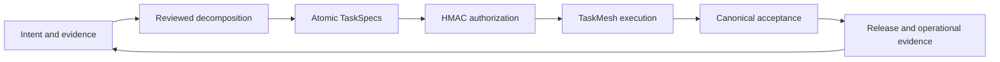

# Integrated toolkit journey

TaskSpec turns intent into reviewed, authorized atomic contracts. TaskMesh
executes their bounded recipes and dependency graphs. The same artifacts and
CLI state can be inspected from any supported harness.

| Area | Start here | Result |
|---|---|---|
| Chat | [Data-engineering walkthrough](chat.md) | Conversation, internal phases, decisions, and durable state |
| Installation | [Install](install.md) | Matching CLI, private Python runtime, Mesh helper, and skills |
| Intake | [Intent](intent.md) | Explicit outcome, sources, constraints, and open decisions |
| Decomposition | [Decomposition and review](decomposition.md) | Reviewed topology, TaskPlan, lineage, and bounded leaves |
| Atomic execution | [Recipes](recipes.md) | A resolved strategy sealed into each managed task |
| Coordination | [Execution and recovery](execution.md) | Durable attempts, resource-aware scheduling, bounded repair |
| Completion | [Acceptance](acceptance.md) | Verified task results and explicit capability proof gaps |
| Operations | [Release and maintenance](sdlc.md) | Reported external observations tied to revisions and artifacts |
| Migration | [Import and rollback](migration.md) | Preserved originals and a fresh native review |
| Commands | [CLI reference](cli.md) | Version-matched commands and machine contracts |

Small, understood changes can start with a directly authored atomic task.
Decomposition depth follows the work. Planning approval, execution authorization,
acceptance, and deployment evidence remain separate decisions and records.
