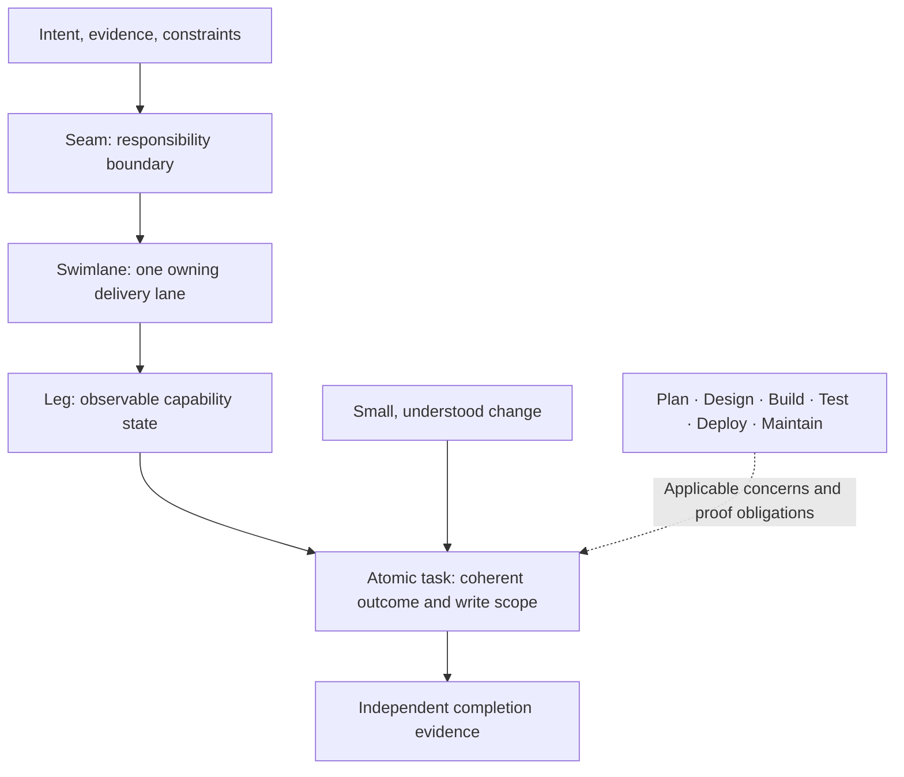
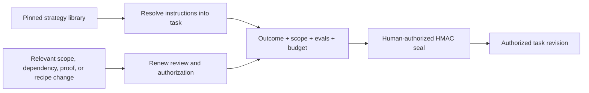
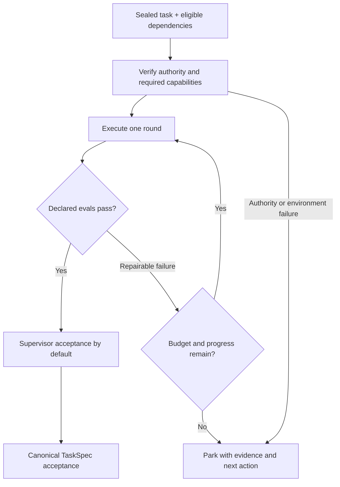
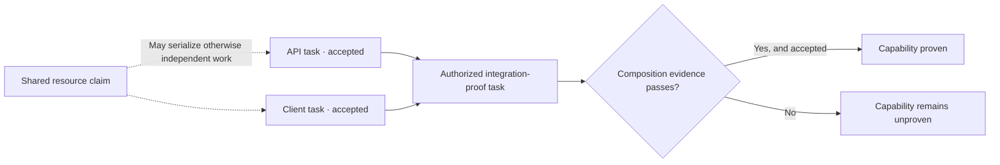
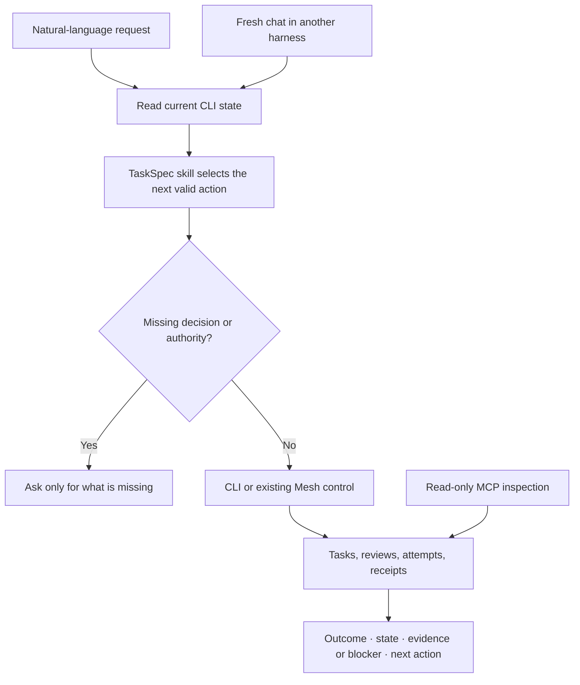
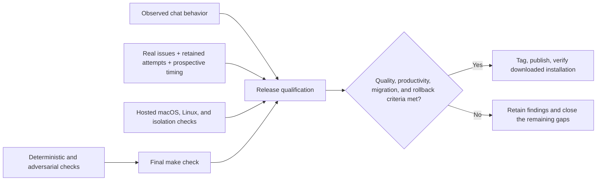

<!-- brief-spec:typed:v1 type=general subject=codebase confidence=high origin=explicit classified_at=2026-09-14T16:50:04.902116Z profile=1.0 decision_id=bsd-61ff3e2b5a4b1e74a49b8cdc -->
# TaskSpec 3.10.0 · Area overview

## Answer

TaskSpec becomes the home for decomposition, atomic contracts, execution recipes, and acceptance. TaskMesh carries out authorized work. The CLI, installed skill, and read-only MCP views expose the same durable state across coding harnesses.

**Current boundary:** the candidate is on main at `79ec514`. Local and hosted macOS/Linux gates plus Linux isolation passed on `649884a`; the later recovery-guide correction has focused documentation and live-chat proof. Current chat coverage is 18/20, with Claude planning and atomic retries held after tool denials. The approved 72-run comparative pilot is running. Canonical acceptance, final qualification, cutover, and publication remain incomplete. See the [local gate](qualification/check-649884a.json), [hosted evidence](qualification/hosted-649884a.json), [chat coverage](qualification/chat-results.json), and [release checklist](checklist.json).

## Rationale

### 1. Decomposition · turn intent into independently provable work

Native decomposition carries Seamwise's semantic engine into TaskSpec. An agent researches the repository and authors a recipe; deterministic checks validate the proposal. Explicit review binds the accepted topology to an authenticated snapshot before compilation and materialization.

Each accepted seam has one owning swimlane. Dependencies and contention explain which leaves can run concurrently. Missing evidence or ownership produces a diagnostic and a recovery step. A small fix can still be authored directly as one atomic task.

**Artifacts:** intent and recipe → review snapshot → TaskPlan and lineage → materialization receipt. New planning workspaces live under `tasks/.plans/<initiative>/`.

### 2. Atomic contracts · keep authority attached to the exact work

The atomic task holds the outcome, write boundary, behaviors, evals, applicable constraints, and optional execution recipe. A recipe is resolved before HMAC authorization, so updating the installed strategy library cannot change previously sealed instructions.

The five initial strategies cover direct work, planned implementation, diagnosis and repair, test-first work, and research with verification. Internal steps remain sequential within one scope and budget. Independently owned or accepted work becomes another task. Format v3 remains the default; legacy readers and direct tasks retain their paths.

### 3. Managed execution · bounded repair with durable recovery

Recipe-managed execution uses TaskMesh even for a one-task graph. TaskMesh verifies readiness and capabilities, creates the existing isolated attempt and handoff, invokes the harness, evaluates the candidate, and records each round.

New recipes default to three rounds and a two-round no-progress breaker. No progress means the failing-eval set and candidate write-surface digest are unchanged. Resume preserves consumed rounds and the original deadline.

Attested autonomy is opt-in. The executor runs in the attested sandbox with fresh credentials per round; evals run on the sanitized host. Execution attestation does not establish evaluator isolation. Required enforcement that an adapter cannot provide must refuse.

### 4. Graphs and capability proof · distinguish leaf completion from integration

Executable dependencies come from canonical leaves. Declared shared resources and overlapping writes serialize conflicting work. Seams, lanes, and legs are derived views of that same work.

An initiative does not become proven merely because every child says `done`. Its integration proof must be an ordinary authorized task with accepted evidence. TaskMesh retains ownership of leases, fencing, cancellation, recovery, and integration branches; the user owns the final target-branch merge.

### 5. AI-native SDLC · carry evidence across every stage

Stages describe concerns within the work. They do not impose organizational swimlanes.

| Stage | What TaskSpec captures | Evidence needed |
| --- | --- | --- |
| Plan | Intent, sources, constraints, ownership, unresolved decisions | Reviewed intent and traceable evidence |
| Design | Seams, alternatives, contracts, capability legs, dependencies | Reviewed topology and validated plan |
| Build | Materialized tasks, sealed recipes, isolated attempts, repair | Candidate artifacts tied to authorization |
| Test | Behavioral evals, regressions, independent checks, composition proof | Canonical acceptance and integration evidence |
| Deploy | Release-readiness work and imported CI/CD records | Source revision, artifact, environment, pipeline, observed result |
| Maintain | Incident observations and corrective-work intake | Source observation, disposition, accepted successor work |

Existing CI/CD and monitoring systems remain external. An imported pipeline success is a reported fact, not proof that the target service is healthy. Incident intake creates candidate work; changes to policies, regression suites, or skills remain reviewable through the same lifecycle.

### 6. Chat, skills, CLI, and MCP · one state across harnesses

The product exposes one `task-spec` skill with short routing instructions and on-demand guides. Root and in-repository skill copies remain byte-identical, and installed guide paths are checked in a fresh installation.

The CLI retains established meanings: `plan` previews a manifest, `batch` materializes it, `run` evaluates, and `accept` controls acceptance. New families cover decomposition, recipe discovery, installed guides, initiative views, and operational evidence. Shared command metadata drives help, completion, documentation, and agent context. Worker-facing MCP inspection does not expose signing authority.

### 7. Packaging and cutover · make the toolkit reproducible

Toolkit installation includes the CLI, a private locked Python runtime for decomposition, matching TaskMesh helper, and installed skill resources. Core gate behavior retains the macOS Bash 3.2 floor. Runtime identity, resource integrity, and skill parity must pass before installation reports readiness.

Existing Seamwise workspaces use an explicit importer. Original identifiers, source artifacts, and digests are retained, and imported plans require fresh native review. New TaskSpec execution has no Seamwise runtime dependency or parallel command facade. Historical sealed tasks and acceptance evidence remain intact.

### 8. Qualification · separate implementation from release proof

The real-work comparison is registered before execution: six repository issues × three workflows × Codex and Claude × two repeats. The workflows use matched source snapshots, scopes, budgets, permissions, and evaluators. Fixed, supervisor-authored recipes make this a delivery experiment for understood issues; architecture discovery is outside its claim.

Failed delivery retains censored elapsed time. Controller activity is not human engineer time. Missing usage stays a gap; synthetic traces do not establish live chat quality. Unfavorable native-harness comparisons must remain in the published evidence.

**Observed qualification finding:** the initial cohort stopped after two of its
72 registered cells. Codex completed its first separate-engine task; Claude's
source edit was denied because the worktree was inside protected `.git/` metadata,
and its lease later expired. Both observations and their costs remain retained.
The prepared worktree, lease-renewal, denial-handling, and cancellation fixes pass
local runtime checks. The corrected cohort was explicitly authorized and is now running with frozen
inputs; no comparative quality or productivity conclusion is established.
See the [runtime findings and proof](qualification/runtime-defects.md).

## Next action

Complete the registered comparison, resolve the two held Claude chat retries, finish canonical acceptance and final source qualification, and publish only after every release criterion passes.

<!-- briefspec:checkpoint:v1 mode=orient -->
## Session Checkpoint · Orient

Headline: The integrated toolkit is implemented as a candidate and is undergoing qualification.
Current state: The candidate is on main. Local and hosted platform gates passed on `649884a`; recovery-guide changes have focused and behavioral proof. The comparative pilot is running. Chat coverage is 18/20, with two denied Claude paths held.

Completed:

- Native decomposition, atomic recipe contracts, managed execution, SDLC evidence paths, and shared product surfaces are present.
- The comparative corpus and 72-run schedule are registered.
- Local and hosted platform qualification passed on commit `649884a`; the later recovery-guide correction passed its focused checks.

Decisions:

- Use real repository issues and prospective intervention recording.
- Keep implementation, acceptance, publication, and deployment evidence distinct.

Proof:

- [direct/pass] [Local gate](qualification/check-649884a.json).
- [direct/pass] [Hosted gates and isolation](qualification/hosted-649884a.json).
- [direct/info] [Registered schedule](pilot/cohorts/approved-runtime/schedule.json).
- [direct/info] [Release checklist](checklist.json).

Next:

- Complete qualification and retain the resulting evidence.

Open:

- Two held Claude retries, comparative results, final source qualification, canonical acceptance, cutover, and publication.
<!-- /briefspec -->
<!-- /brief-spec -->
